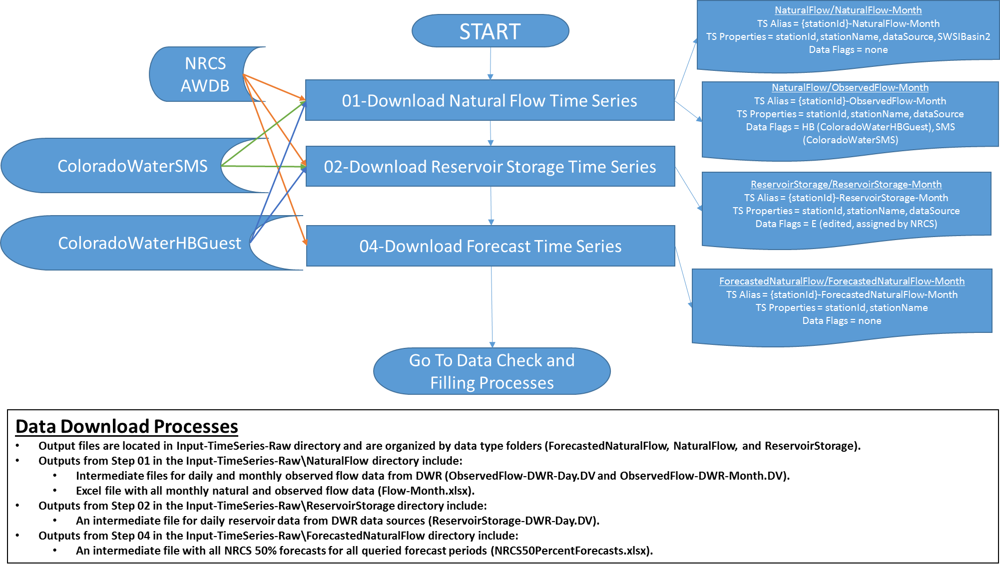
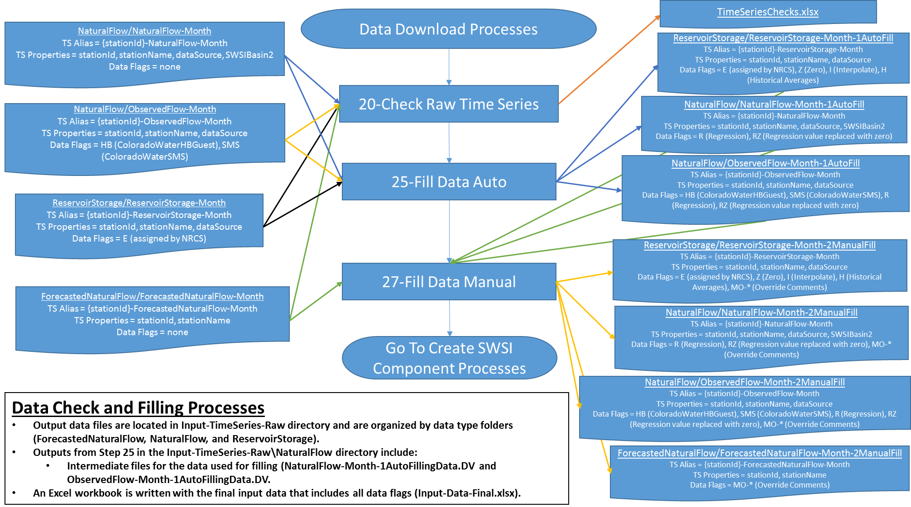
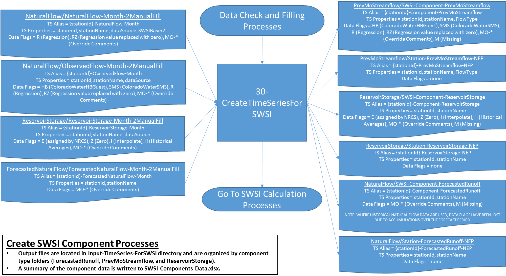
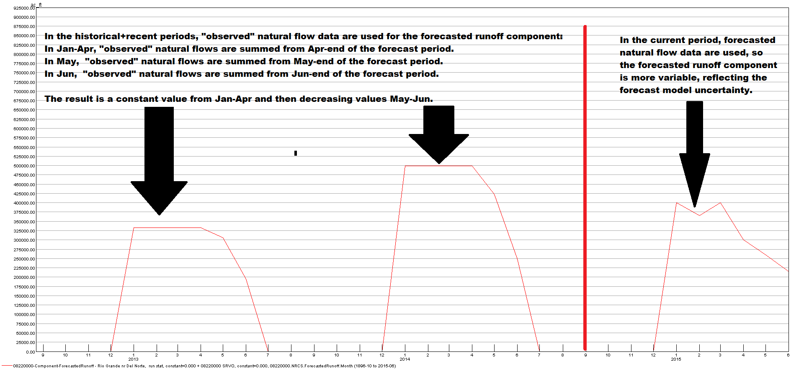
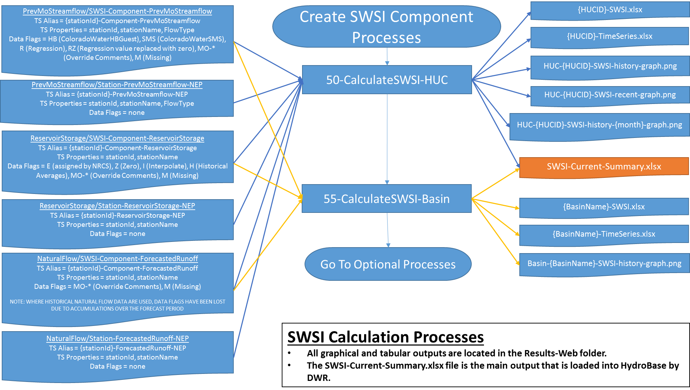
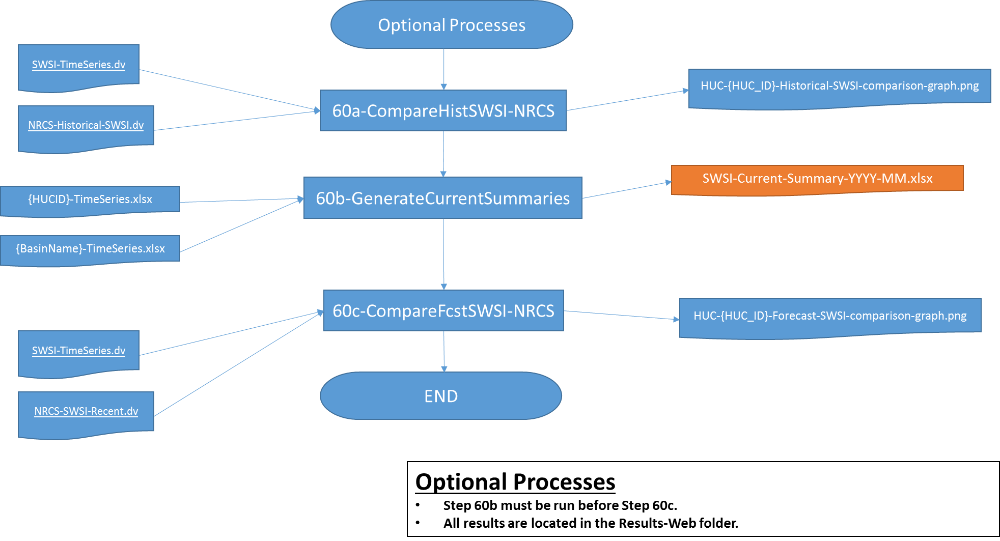

# Appendix B / Colorado SWSI Workflow Details #

This appendix provides details about the TSTool command files that implement the automated SWSI analysis workflow.

* [Control File](#control-file)
* [TSTool Processing](#tstool-processing)
    + [`01-DownloadNaturalFlowTimeSeries.tstool`](#01-downloadnaturalflowtimeserieststool)
    + [`02-DownloadReservoirStorageTimeSeries.tstool`](#02-downloadreservoirstoragetimeserieststool)
    + [`04-DownloadNaturalFlowForecast.tstool`](#04-downloadnaturalflowforecasttstool)
    + [`20-CheckRawTimeSeries.tstool`](#20-checkrawtimeserieststool)
    + [`25-FillDataAuto.tstool`](#25-filldataautotstool)
    + [`27-FillDataManual.tstool`](#27-filldatamanualtstool)
    + [`30-CreateTimeSeriesForSWSI.tstool`](#30-createtimeseriesforswsitstool)
    + [`50-CalculateSWSI-HUC.tstool`](#50-calculateswsi-huctstool)
    + [`55-CalculateSWSI-Basin.tstool`](#55-calculateswsi-basintstool)
    + [`60a-CompareHistSWSI-NRCS.tstool`](#60a-comparehistswsi-nrcststool)
    + [`60b-GenerateCurrentSummaries.tstool`](#60b-generatecurrentsummarieststool)
    + [`60c-CompareFcstSWSI-NRCS.tstool`](#60c-comparefcstswsi-nrcststool)

----

## Control File ##

An Excel workbook (`CO-SWSI-Control.xlsx`) is used to control the Colorado SWSI analysis. A description of the worksheets follows:

* ***Hist***: History of the workbook. This worksheet should be used to note major changes
  to the control file or the Colorado SWSI Automation Tool program version.
* ***Notes***: Descriptions of each worksheet
* ***Config***: Worksheet where the configuration properties needed to run TSTool are specified.
  User-entered values are highlighted in blue. Values that are automatically calculated are highlighted in gray.
  The configuration properties are named to help TSTool retrieve the values.
* ***Combined Inputs***: This worksheet defines the stations that are used in the HUC and the Basin analyses.
    + For reservoir storage, ***Datastore*** can be `NrcsAwdb` or `ColoradoWaterSMS`, while ***Datastore2*** can be `ColoradoWaterHBGuest`.
    + For natural flows, ***Datastore*** should be `NrcsAwdb`.
      For observed flow option, ***Datastore2*** should be `ColoradoWaterHBGuest` while ***Datastore3*** can be `ColoradoWaterSMS`.
* ***FlowDataFill***: Worksheet that specifies automated filling to be done on the natural flow stations.
* ***ReservoirDataFill***: Worksheet that specifies automated filling to be done on the reservoirs.
* ***NatFlowCalcs***: Scratch worksheet for natural flow calculations,
  to be modified monthly as necessary when data are not available from web services.
* ***Overrides***: User-determined values that override any existing data.
* Lookup Tables: Tables of information needed by TSTool.
    + ***Month_Table*** is used to loop on months and to specify when different components are used in the SWSI analysis.
    + ***RawDataChecks Style Table*** and ***RawDataChecks Condition Table*** are used to
      highlight missing counts > 0 in red in `RawDataChecks.xlsx`.
    + ***Data Fill Date Options*** are used to provide validation lists for ***Fill Start Date***
      and ***Fill End Date*** on the ***FlowDataFill*** worksheet.
    + The ***Reservoir Start Fill Methods*** and ***Reservoir End Fill Methods***
      are used to provide validation lists on the ***ReservoirDataFill*** worksheet.
    + The ***Data Types List*** is used to provide validation lists on the ***Overrides*** worksheet.
    + The ***DataFlags Style Table*** and ***DataFlags Condition Table*** are used to highlight
      cells based on the data flag in the cell comment in the `Input_Data_Final.xlsx`.
* ***HUC_Reference***: List of HUC ids and names for user reference only (not used in the analysis workflow).

## TSTool Processing ##

There are five conceptual processing steps in the TSTool SWSI Automation Tool:

* Data download
* Data checks and filling
* Creation of SWSI components
* SWSI calculation and products
* Optional processes

This appendix provides an overview of each component,
with detailed explanations of the TSTool processes within each component.
In the process flowcharts (Figure 8, Figure 9, Figure 10, Figure 12, and Figure 13):

* “TS Alias” refers to the time series aliases used by TSTool to identify time series.
* “TS Properties” are time series properties used by TSTool during processing and for outputs,
  accessible in commands using the `${Property}` notation.
* “Data Flags” are used by TSTool to indicate manipulation of data values.

The process flow charts are also provided in PowerPoint format in the `_Documents\ _SWSI-TSTool-Guide` directory.

**

**

**

Figure 8 - Flowchart of the Data Download Processes (<a href="../flowchart-data-download.png">see also the full-size image</a>)

**

## `01-DownloadNaturalFlowTimeSeries.tstool` ##

### Purpose ###

* Automatically download monthly “observed” natural flows for the full period of data availability for
  NaturalFlow stations identified on the ***Combined Inputs*** worksheet where the ***Include*** column is set to `YES`.
  These data are used for the previous month’s streamflow and forecasted runoff components in the Colorado SWSI.
* If needed, automatically download monthly observed (i.e., gaged) streamflows for the full period of data
  availability for NaturalFlow stations identified on the ***Combined Inputs*** worksheet where the ***Include*** column is set to `YES-OBS`.
  These data are used for the previous month’s streamflow component in the Colorado SWSI
  in rare cases when the required natural flow data are not available.
  If this option is applied, observed flow data are used for the previous month’s streamflow component
  for all periods (i.e., historical period, recent period, and current period).

### Workflow Details ###

* First, the command file checks to see if the user has specified that any observed flow data be used in the Colorado SWSI analysis.
  This case is signified by NaturalFlow stations on the ***Combined Inputs*** worksheet in the control
  file that have the ***Include*** column set to `YES-OBS`.
* If the observed flow case exists, the command file checks affected HUCs to see whether all natural
  flow stations in the affected HUC have been assigned to use observed flow data.
  If not, a warning message is written out to the user.
  The user can choose to ignore the warnings or to set all stations to use observed flow data.
* Natural flow data are downloaded for all NaturalFlow stations on the ***Combined Inputs*** worksheet where
  the ***Include*** column is set to `YES`.
  Natural flow data are downloaded even in the “observed flow” case because the data are used for the forecasted runoff component.
    + The command file is set up to use the NRCS AWDB web service to obtain monthly natural streamflow volumes (using the SRVO data type).
    + Stations can be associated with more than one HUC, so a unique station list is created as a table.
    + Station identifiers, station names, and the data source are set as properties to support SWSI processing and output products.
    + A time series property (SWSI Basin2) is set to differentiate stations in the Rio Grande basin from stations in other
      basins – this property is used in step 30 when accumulating monthly natural flows over the forecast period.
      Stations in the Rio Grande basin are accumulated through September,
      while stations in other basins are accumulated through July.
    + Automated checks are included to ensure that the number of time series matches the number of stations,
      and to warn the user about any time series that are completely missing.
    + The monthly natural flow data are written to a DateValue file.
* Observed flow data are downloaded for all NaturalFlow stations on the ***Combined Inputs*** worksheet
  where the ***Include*** column is set to `YES-OBS`. These data are used only for the previous month’s streamflow component.
    + If no stations are set to use observed flow data, this set of commands is bypassed and no observed flow output file is written.
    + The command file is set up to use the ColoradoWaterSMS and ColoradoWaterHBGuest web services to
      obtain historical streamflow volumes (using the DISCHRG and Streamflow data types, respectively).
      Typically, data from these two sources must be merged for a complete record.
    + The command files were set up assuming that all stations assigned to use observed flows
      will have data available from the ColoradoWaterHBGuest web service.
      Additional data can optionally be obtained using the ColoradoWaterSMS web service.
    + Stations can be associated with more than one HUC, so unique station lists are created as tables for each web service.
    + Processing for the ColoradoWaterSMS web service is done first.
        - The ColoradoWaterSMS web service returns daily streamflow data.
        - Calls to this service will fail if the request includes a start date before January 1, 2000.
          Therefore, the data call uses a start date of January 1, 2000 which is set in the
          control file as the SMSInputPeriodStartDayText property.
        - Station information for the ColoradoWaterSMS web service is specified in the ***Datastore3*** columns on the ***Combined Inputs*** worksheet.
        - Station identifiers, station names, and the data source are set as properties to support SWSI processing and output products.
        - Calls to the ColoradoWaterSMS web service do not automatically set units on the returned time series.
          Therefore, a [`SetTimesSeriesProperty`](https://opencdss.state.co.us/tstool/latest/doc-user/command-ref/SetTimeSeriesPropoerty/SetTimeSeriesProperty/)
          command is used to set the units to cfs.
        - The data are converted to ac-ft/day.
        - The time series are converted from daily to monthly time series with units of ac_ft.
        - The ColoradoWaterSMS and ColoradoWaterHBGuest web services in some cases use different location IDs for the same station.
          For example, for the Mancos near Mancos station, the ColoradoWaterSMS service uses a station identifier of
          MANMANCO while the ColoradoWaterHBGuest web service uses the identifier of 09370500.
          To anticipate this issue, the aliases for time series returned by the ColoradoWaterSMS
          web service are changed to use station identifiers as the location IDs.
        - Automated checks are included to ensure that the number of time series matches the number of stations,
          and to warn the user about any time series that are completely missing.
    +  Processing for the ColoradoWaterHBGuest web service is done second.
        - The ColoradoWaterHBGuest web service returns monthly streamflow data.
        - Station information for the ColoradoWaterHBGuest web service is specified in the ***Datastore2*** columns on the Combined Inputs worksheet.
        - Station identifiers, station names, and the data source are set as properties to support SWSI processing and output products.
        - Automated ed checks are included to ensure that the number of time series matches the number of stations,
          and to warn the user about any time series that are completely missing.
    +  Data from the ColoradoWaterSMS and ColoradoWaterHBGuest web services are merged to produce continuous monthly time series for each station.
        - HydroBase data are given precedence since these data are published values.
        - Data flags are set to `HB` or `SMS` to indicate the data source.
        - After merging, a “Scale” time series is used with a multiplier of 1 to reset the units from `ACFT` to `ac_ft`,
          consistent with other data types used later on for the SWSI analysis.
        - The daily and monthly observed flow data are written to DateValue files.
    + The monthly natural and observed flow data are written to an Excel file called `Flow-Month.xlsx`.
* At times (for example, on holidays), the NRCS AWDB web services are down.
  If no data are returned, the user should check the NRCS website and try again when the services are running.

### `02-DownloadReservoirStorageTimeSeries.tstool` ###

#### Purpose ####

* Automatically produce end-of-month reservoir time series for the full period of data
  availability for ReservoirStorage stations identified on the Combined Inputs worksheet.

#### Workflow Details ####

* The command file is set up currently to use two data sources:
    + The NRCS AWDB web service.
    + The DWR ColoradoWaterSMS and ColoradoWaterHBGuest web services.
      If data are being obtained from DWR, ***Datastore*** in the control file should be specified as ColoradoWaterSMS
      and ***Datastore2*** in the control file should be specified as ColoradoWaterHBGuest.
      The process will run if ColoradoWaterSMS is specified as ***Datastore***, but ***Datastore2*** is left null
      (for example, because a reservoir is new and no data exist in HydroBase).
      Typically, data from these two sources must be merged for a complete record.
    + The NRCS and DWR data sources cannot be mixed for a given reservoir.
* Reservoirs can be associated with more than one HUC, so a unique list is created as a table.
* Unique lists are then created depending on the specified datastores so that separate data calls
  can be made to each data source (i.e., NRCS AWDB, ColoradoWaterSMS, ColoradoWaterHBGuest).
* Data are obtained from Colorado DWR data sources:
    + Data are obtained from ColoradoWaterSMS:
        - Calls to the ColoradoWaterSMS web service will fail if the start date is prior to 2000.
          Therefore, before making the call to ColoradoWaterSMS, the input period is limited to begin in 2000.
        - The ColoradoWaterSMS web service returns daily data, so the start and end dates must also be specified on a daily time step.
        - Station ID, station name, and data source properties are assigned.
        - The units of the data returned from ColoradoWaterSMS are not set by default, so the units are explicitly set to ACFT.
        - Automated checks are performed to ensure that the number of time series created matches the expected number,
          and to warn the user about any time series that are completely missing.
    + Data are obtained from ColoradoWaterHBGuest.
        - The input period is reset to the full period.
        - The ColoradoWaterHBGuest datastore information is contained in the control workbook under Datastore2 columns on the ***Combined Inputs*** worksheet.
        - The ColoradoWaterHBGuest web service returns daily data, so the start and end dates must also be specified on a daily time step.
        - Station ID, station name, and data source properties are assigned.
        - Automated checks are performed to ensure that the number of time series created matches the expected number,
          and to warn the user about any time series that are completely missing.
    + ColoradoWaterSMS and ColoradoWaterHBGuest data are merged to produce continuous daily time series over the full period.
        - A new time series is created for the full period.
        - The new time series is filled first with data from ColoradoWaterHBGuest data, which takes precedence over ColoradoWaterSMS data.
          Data flags are set to `HB` for HydroBase to signify the data source.
        - The new time series is then filled with data from ColoradoWaterSMS data.
          Data flags are set to `SMS` to signify the ColoradoWaterSMS web service as the data source.
        - The merged data are multiplied by 1 and the units are set to ac_ft to be consistent with the other data components.
    + The merged, daily DWR data are converted to end-of-month time series to be consistent with the data returned from the NRCS.
        - Station ID, station name, and data source properties are assigned.
        - The data flags from the daily time series are not transferred to the monthly time series.
* Data are obtained from the NRCS AWDB web service:
    + Station ID, station name, and data source properties are assigned.
    + Automated checks are performed to ensure that the number of time series created matches the expected number,
      and to warn the user about any time series that are completely missing.
    + At times (for example, on holidays), the NRCS AWDB web services are down.
      If no data are returned, the user should check the NRCS website and try again when the services are running.
* The final data written out represent end-of-month storage values in ac-ft using time series aliases of
  `{stationId}-ReservoirStorage-Month` regardless of data source.  This facilitates generic logic in following steps.

### `04-DownloadNaturalFlowForecast.tstool` ###

#### Purpose ####

* Automatically produce time series of 50th percent exceedance forecasts for the appropriate
  forecast period for ForecastedNaturalFlow stations identified on the Combined Inputs worksheet.

#### Workflow Details ####

* Stations can be associated with more than one HUC, so a unique station list is created as a table.
* Separate lists of unique stations are created depending on whether the station is
  located in the Rio Grande basin or the other basins.
  The forecast period (April-September) differs in the Rio Grande basin from the forecast
  period (April-July) used in other basins.
* [`ExpandTemplateFile`](https://opencdss.state.co.us/tstool/latest/doc-user/command-ref/ExpandTemplateFile/ExpandTemplateFile/)
  commands are used to generate strings of concatenated station
  identifiers separated by commas (for example: `stationA,stationB,stationC`).
  The strings are saved as properties: ForecastedNaturalFlowListUniqueRioGrandeIds and ForecastedNaturalFlowListUniqueNonRioGrandeIds.
  These properties are used in [`ReadNrcsAwdb`](https://opencdss.state.co.us/tstool/latest/doc-user/command-ref/ReadNrcsAwdb/ReadNrcsAwdb/)
  commands to specify the station list.
* Six separate calls are made to the NRCS AWDB data service depending on the station location and forecast period:
    +  Rio Grande: `APR-SEP`, `MAY-SEP`, and `JUN-SEP`.
    +  Non-Rio Grande: `APR-JUL`, `MAY-JUL`, and `JUN-JUL`.
* The calls to the NRCS AWDB service return natural flow (SRVO) forecasts with an exceedance probability of 50%.
* The results from each call to the NRCS AWDB service are saved in separate tables,
  but all results are appended to the master NRCS_50PercentForecasts table.
* The forecast values are multiplied by 1000 to get units of ac-ft.
    +  **Note: As of June 2015, the NRCS service was returning forecast values with units of both ac-ft and kac-ft,
       though values indicated units solely of kac-ft.
       The NRCS confirmed via e-mail that all forecast values for locations in Colorado are in
       kac-ft and that the unit codes would be updated accordingly.**
* The [`TableToTimeSeries`](https://opencdss.state.co.us/tstool/latest/doc-user/command-ref/TableToTimeSeries/TableToTimeSeries/)
  command is used to generate time series of 50th percent
  exceedance forecasts by location as shown in Table 12.
* Properties are read from Excel to determine if the current month’s analysis is using the forecasted runoff component.
  If so, the forecast data returned from the NRCS will extend to the current month.
  If not, the time series need to be explicitly extended to the current month,
  though the values will be missing starting in July of the current year (because the last forecast issued by the NRCS each year is published in June).
* Station id and station name properties are assigned to the time series.
* An automated check is performed to confirm that the number of time series created matches the number of stations.
* At times (for example, on holidays), the NRCS AWDB web services are down.
  If no data are returned, the user should check the NRCS website and try again when the services are running.

**

Table 12 - Forecast Values by Month and Location

**

| **MONTH** | **RIO GRANDE BASIN** | **NON-RIO GRANDE BASIN** |
| -- | -- | -- |
| JAN | APR-SEP | APR-JUL |
| FEB | APR-SEP | APR-JUL |
| MAR | APR-SEP | APR-JUL |
| APR | APR-SEP | APR-JUL |
| MAY | MAY-SEP | MAY-JUL |
| JUN | JUN-SEP | JUN-JUL |
| JUL-DEC | Not applicable | Not applicable |

**

**

**

Figure 9 - Flowchart of the Data Check and Filling Processes (<a href="../flowchart-data-check-fill.png">see also the full-size image</a>)

**

### `20-CheckRawTimeSeries.tstool` ###

#### Purpose ####

* Summarize the number of missing values for each raw station time series for various time windows.

#### Workflow Details ####

* The time series checks are performed by expanding a template file (Template-Check-InputTimeSeries.TSTool).
* The raw data time series are read from the start of the historical period to the current month.
* Time series properties are set to indicate the data type: natural flow, reservoir storage, or forecasted natural flow.
* The [`CalculateTimeSeriesStatistic`](https://opencdss.state.co.us/tstool/latest/doc-user/command-ref/CalculateTimeSeriesStatistic/CalculateTimeSeriesStatistic)
  command is used to count the number of missing values in
  each station time series and assign the value to a time series property.
* The natural flow data are used in both the previous month’s streamflow and the forecasted runoff components.
    + For the previous month’s streamflow component,
      June-August streamflow volumes are shifted forward by one month to use in July-September SWSI calculations.
      Therefore, raw data are needed in the months of June-August for the full analysis period through the previous month.
    + For the forecasted runoff component, April-September streamflow volumes are
      accumulated to represent the runoff over the forecast period.
        - Depending on the RecentPeriodFlowDataType property, the observed natural
          flows are used in the historical and recent periods, or just the historical period.
    + The above requirements are combined to assess the following missing count properties:
        - The number of missing values from April-September in the historical period.
        - If `RecentPeriodFlowDataType=NaturalFlow`, the number of missing values from April-September in the recent period.
        - If `RecentPeriodFlowDataType=ForecastedNaturalFlow`, the number of missing values from June-August in the recent period.
        - The number of missing values from June-August in the current water year through the previous month.
        - The number of missing values from June-August for the previous month.
* The forecasted natural flow data are used in the forecasted runoff component.
  Raw data values represent accumulated runoff volumes over the relevant forecast period.
  The forecasted runoff component is used from Jan-Jun in the SWSI analysis.
  These requirements are combined to assess the following missing count properties:
    + If `RecentPeriodFlowDataType=ForecastedNaturalFlow`,
      the number of missing values from Jan-Jun in the recent period.
    + The number of missing values from Jan-Jun for the current water year.
    + The number of missing values from Jan-Jun for the current month.
* The reservoir storage data are used for the reservoir storage component year-round in the SWSI analysis.
  The previous month’s end-of-month storage value is shifted forward by one month to
  represent the current month’s beginning-of-month storage value.
  These requirements are combined to assess 4 missing count properties:
    + The number of missing values in the historical period.
    + The number of missing values in the recent period.
    + The number of missing values in the current water year through the previous month.
    + The number of missing values for the previous month.
* The missing count properties are written to summary tables and sorted for output.
    + For natural flow data, the output is sorted by number of missing values in the
      historical period (descending) to highlight the stations with the most missing data.
    + For the forecasted runoff data, the output is sorted by the number of
      missing values for the current month (descending).
    + For the reservoir storage data, the output is sorted by number of missing values
      in the historical period (descending) to highlight the stations with the most missing data.
* If observed flow data are being used in the analysis:
    + The observed flow data are used in the previous month’s streamflow component.
    + For the previous month’s streamflow component, June-August streamflow volumes are shifted forward
      by one month to use in July-September SWSI calculations.
      Therefore, raw data are needed in the months of June-August for the full analysis period through the previous month.
    + The above requirements are combined to assess 4 missing count properties:
        - The number of missing values from June-August in the historical period.
        - The number of missing values from June-August in the recent period.
        - The number of missing values from June-August in the current water year through the previous month.
        - The number of missing values from June-August for the previous month.
* The results are written to an Excel workbook and conditional formatting is applied
  to highlight cells where the missing count is greater than 0 in red.
* Additionally, a list of missing values is created and written to Excel,
  assuming that the number of missing values is greater than zero.

### `25-FillDataAuto.tstool` ###

#### Purpose ####

* Fill missing values in the raw time series using automated filling techniques in TSTool
  (regression analysis, interpolation, historical monthly averages, and zero values).

#### Workflow Details ####

* To fill missing values in the natural flow dataset:
    + The raw natural flow data are read.
    + A property is set to indicate that these stations are needed for the SWSI analysis,
      to differentiate later on from stations used solely for filling data.
    + The filling table is read from the control workbook from the FlowDataFill worksheet
      where Flow Type = Natural and Include <> `NO`.
    + A list of stations is created to indicate filling stations whose data have not yet been downloaded.
    + Data are obtained for these additional stations from the NRCS AWDB web services.
    + An automatic check is performed to confirm that data were returned for all additional stations.
    + A loop is run over the stations that need to be filled:
        - Properties are set to indicate the filling station ID, the fill start date, and the fill end date.
        - The [`FillRegression`](https://opencdss.state.co.us/tstool/latest/doc-user/command-ref/FillRegression/FillRegression/)
          command is used to perform the filling using monthly regression equations.
          The regression statistics are written to the NatFlow_RegressionStats table.
        - Filled data are assigned a data flag of “R” to indicate regression filling.
        - To prevent cases where the filled value is negative,
          a [`ReplaceValue`](https://opencdss.state.co.us/tstool/latest/doc-user/command-ref/ReplaceValue/ReplaceValue/)
          command is used to set negative values to zero and reset the data flag to RZ
          to indicate filled values were replaced with zeroes.
          This situation can happen when a downstream station with much larger flows is used for filling,
          resulting in a regression equation with a negative intercept.
    + The original or filled data are written to DateValue and Excel formats.
    + The filling data are written to DateValue format as an archive.
* If observed flow data are being used:
    + To fill missing values in the observed flow dataset:
        - The raw observed flow data are read.
        - A property is set to indicate that these stations are needed for the SWSI analysis,
          to differentiate later on from stations used solely for filling data.
        - The filling table is read from the control workbook from the FlowDataFill worksheet where Flow Type = Observed and Include <> “NO”.
        - If any observed data filling has been specified:
            * A list of stations is created to indicate filling stations whose data have not yet been downloaded.
            * Data are obtained for these additional stations from the ColoradoWaterHBGuest web service.
            * An automatic check is performed to confirm that data were returned for all additional stations.
            * A loop is run over the stations that need to be filled.
                * Properties are set to indicate the filling station ID, the fill start date, and the fill end date.
                * The [`FillRegression`](https://opencdss.state.co.us/tstool/latest/doc-user/command-ref/FillRegression/FillRegression/)
                  command is used to perform the filling using monthly regression equations.
                  The regression statistics are written to the ObsFlow_RegressionStats table.
                * Filled data are assigned a data flag of “R” to indicate regression filling.
                * To prevent cases where the filled value is negative, a
                  [`ReplaceValue`](https://opencdss.state.co.us/tstool/latest/doc-user/command-ref/ReplaceValue/ReplaceValue/)
                  command is used to set negative values
                  to zero and reset the data flag to RZ to indicate filled values were replaced with zeroes.
                  This situation can happen when a downstream station with much larger flows is used for filling,
                  resulting in a regression equation with a negative intercept.
        - The original or filled data are written to DateValue and Excel formats.
        - The filling data are written to DateValue format as an archive.
* To fill missing values in the reservoir storage dataset:
    + The raw reservoir storage data are read.
    + The filling table is read from the control workbook from the ReservoirDataFill worksheet.
    + The first filling loop involves filling the start of the data record with zeroes if the reservoir was not yet storing water.
      Filled data flags are set to Z for zeroes.
    + The second filling loop involves filling missing values by interpolating between existing values.
      This approach is typically selected when only a few data values are missing.
      Filled data flags are set to I for interpolate.
    + The third filling loop involves filling missing values using historical monthly averages.
      This approach is typically used when more than one year of data is missing.
      Filled data flags are set to H for historical monthly averages.
    + The fourth filling loop is applied to reservoirs that have been decommissioned and are no longer storing water.
      In this case, missing values are set to zero through the current month. Filled data flags are set to Z for zeroes.
    + The filled data are written to DateValue and Excel formats.
* A data check summary is performed on the filled natural flow data, the filled observed flow data (if used),
  the filled reservoir storage data, and the raw forecasted natural flow data to provide an update on the status of missing data.
  The time series aliases and dates with missing values are written to a summary table and to Excel.

### `27-FillDataManual.tstool` ###

#### Purpose ####

* Fill missing values (or replace existing values) in the raw time series using user-specified values.

#### Workflow Details ####

* The override table is read from the control workbook from the Overrides worksheet.
* Conditional formatting tables are read from the control workbook on the Lookup Values worksheet.
* If observed data are being used in the analysis:
    + The auto-filled observed flow data are read.
    + The [`SetTimeSeriesValuesFromTable`](https://opencdss.state.co.us/tstool/latest/doc-user/command-ref/SetTimeSeriesValuesFromTable/SetTimeSeriesValuesFromTable/)
      command is used to apply override values and set
      filled data flags based on the overrides comment column from the control workbook.
* The auto-filled natural flow data are read.
* The [`SetTimeSeriesValuesFromTable`](https://opencdss.state.co.us/tstool/latest/doc-user/command-ref/SetTimeSeriesValuesFromTable/SetTimeSeriesValuesFromTable/) command
  is used to apply override values and set
  filled data flags based on the overrides comment column from the control workbook.
* The auto-filled reservoir storage data are read.
* The [`SetTimeSeriesValuesFromTable`](https://opencdss.state.co.us/tstool/latest/doc-user/command-ref/SetTimeSeriesValuesFromTable/SetTimeSeriesValuesFromTable/)
  command is used to apply override values and set
  filled data flags based on the overrides comment column from the control workbook.
* The raw forecasted natural flow data are read.
* The [`SetTimeSeriesValuesFromTable`](https://opencdss.state.co.us/tstool/latest/doc-user/command-ref/SetTimeSeriesValuesFromTable/SetTimeSeriesValuesFromTable/)
  command is used to apply override values and set
  filled data flags based on the overrides comment column from the control workbook.
* The manual-filled time series are written to DateValue format for use in later TSTool processing steps.
* A summary of the final input data are written to `Input_Data_Final.xlsx`.
  Cell comments are used to show where data values were filled.
  The cells are also color-coded based on the data fill flag to facilitate user review.
* A data check summary is performed on the manual-filled natural flow data, the manual-filled reservoir storage data,
  and the manual-filled forecasted natural flow data to provide an update on the status of missing data.
  The time series aliases and dates with missing values are written to a summary table and to Excel.

**

**

**

Figure 10. Flowchart of the Create SWSI Component Processes (<a href="../flowchart-create-swsi.png">see also the full-size image</a>)

**

### `30-CreateTimeSeriesForSWSI.tstool` ###

#### Purpose ####

* Automatically produce the component time series needed for the SWSI calculation
  by station so that they can be added by HUC in a later processing step.

#### Workflow Details ####

* Reservoir storage component:
    + This component is used year-round.
    + Input data are shifted forward by one month to use the previous month’s end-of-month value
      as the current month’s beginning-of-month storage value.
      The data shift is accomplished using the
      [`ShiftTimeByInterval`](https://opencdss.state.co.us/tstool/latest/doc-user/command-ref/ShiftTimeByInterval/ShiftTimeByInterval/) command.
* Previous month’s streamflow component (see Table 3 in the
  [SWSI Methodology](../co-methodology/co-methodology.md#previous-months-streamflow) for example data transformations):
    + This component is used from Jul-Sep.
    + The expected situation is that natural flow data will be used.
      However, the user can opt to use observed flow data for one or more stations instead.
    + The natural flow data are read and assigned a FlowType property of “NatFlow”.
    + If observed data are being used:
        - The observed flow data are read.
        - For each station assigned to use observed flow data:
            * The natural flow time series is freed from memory.
            * The observed flow time series is copied to a new time series with an alias of
              `{stationId}-Component-PrevMoStreamflow`, which is consistent with that used for the natural flow data.
            * The new time series is assigned a FlowType property of `ObsFlow`
              to help distinguish in the outputs where observed flow data were used.
    + All data are shifted forward by one month to use the previous month’s volume as the
      current month’s previous month’s streamflow value.
      The data shift is accomplished using the
      [`ShiftTimeByInterval`](https://opencdss.state.co.us/tstool/latest/doc-user/command-ref/ShiftTimeByInterval/ShiftTimeByInterval/) command.
    + The monthly values are set to 0 from Oct-Jun (when this component is not used) using a
      [`SetConstant`](https://opencdss.state.co.us/tstool/latest/doc-user/command-ref/SetConstant/SetConstant/) command.
* Forecast runoff component:
    + This component is used Jan-Jun.
    + The historical period is treated differently from the current period, so two component time series are generated and then merged.
        - For the historical period:
            * Historical natural flow data are accumulated over the appropriate forecast
              period based on month and location (see Table 12).
                * The SWSI Basin2 time series property is used to differentiate stations in the Rio Grande basin versus stations outside the Rio Grande basin.
                * Because of the transformations applied to the natural flow data to accumulate runoff volumes over the forecast period,
                  the data flags are not propagated through this step.
            * Two [`RunningStatisticTimeSeries`](https://opencdss.state.co.us/tstool/latest/doc-user/command-ref/RunningStatisticTimeSeries/RunningStatisticTimeSeries/)
              commands are used to perform the accumulation of monthly natural
              flows to the forecast period (one for Rio Grande stations, and one for non-Rio Grande stations).

                Offset-duration notation is used to specify the start and end of the accumulation period (see Table 13).
                For example, in January for a station in the Rio Grande basin,
                the monthly flows need to be accumulated for APR-SEP and the offset-duration value is specified as 3-8.
                Relative to Jan, Apr is 3 months ahead and Sep is 8 months ahead.

                **

                Table 13 - Offset notation used to accumulate monthly historical natural flows over the forecast period.
                
**

                | **MONTH** | **RIO GRANDE BASIN** | **NON-RIO GRANDE BASIN** | **Forecast Period** | **Offset-Duration Notation** | **Forecast Period** | **Offset-Duration Notation** |
                | -- | -- | -- | -- | -- | -- | -- |
                | JAN | APR-SEP | 3-8 | APR-JUL | 3-6 |
                | FEB | APR-SEP | 2-7 | APR-JUL | 2-5 |
                | MAR | APR-SEP | 1-6 | APR-JUL | 1-4 |
                | APR | APR-SEP | 0-5 | APR-JUL | 0-3 |
                | MAY | MAY-SEP | 0-4 | MAY-JUL | 0-2 |
                | JUN | JUN-SEP | 0-3 | JUN-JUL | 0-1 |
                | JUL-DEC | Not applicable | Not applicable | Not applicable | Not applicable |

                * The data values are set to 0 in Jul-Dec when the forecast runoff component is not used.
                * The data values are set to 0 for the current period, when forecasts are used instead of “observed” natural flows.

    * For the current period:
        - Forecasted natural flows over the forecast period are used.
        - The data values are set to 0 in Jul-Dec when the forecast runoff component is not used.
        - The data values are set to 0 for the historical, when “observed” natural flows are used instead of forecasts.
    + If the RecentPeriodFlowType = NaturalFlow, then the forecasted runoff in the recent period is computed like the historical period.
      This is the default case where historical natural flows are used for the forecasted runoff component.
    + If the RecentPeriodFlowType = ForecastedNaturalFlow,
      then the forecasted runoff in the recent period is computed like the current period.
      This is the re-forecast option where forecasts are used for the forecasted runoff component in the recent period.
    + The historical and current time series are merged.
      Figure 11 presents an example of a merged time series to demonstrate that values are more variable in the current
      period (when forecasts are used) than in the historical period (when historical natural flows are used).
        - In the historical period, “observed” natural flows are accumulated from monthly natural flow values.
          We know what the natural flows were in past years. This fact means that for the months of Jan-Apr,
          when the forecast period is constant, the forecasted runoff component values are also constant from month to month.
          In May and June, the forecasted runoff component values decrease to reflect less time from the current month until the end of the forecast period.
        - In the current period, when forecasts are used,
          the forecasted runoff component is more variable because it also reflects forecast model uncertainty.

**

**

**

Figure 11 - Example of the Forecasted Runoff Component (<a href="../example-forecasted-runoff.png">see also the full-size image</a>)

**

* NEP Values by Month are calculated for each station by first calculating the Gringorten plotting
  position and then multiplying the results by 100.
  The NEP time series are set to missing in months when the component is not being used.
* A data check summary is performed on the final component data.
  The time series aliases and dates with missing values are written to a summary table and to Excel.

**

**

**

Figure 12. Flowchart of the SWSI Calculation Processes (<a href="../flowchart-swsi-calculation.png">see also the full-size image</a>)

**

### `50-CalculateSWSI-HUC.tstool` ###

#### Purpose ####

* Perform all of the SWSI-related calculations and generate all of the SWSI output products on a HUC8 basis.

#### Workflow Details ####

* Many properties are read from the control file related to the start and end dates of the historical,
  recent, and current periods, as well as dates and annotation placements to support the graphical outputs.
* A lookup table of month properties is read from Excel that crosswalks month IDs (1-12)
  with month abbreviations (JAN-DEC). This information is used to loop on months and generate monthly outputs
  in graphical and tabular formats.
  This table is also used to set three flags that indicate which SWSI components are used in the
  current month: ReservoirFlag, PrevMoFlowFlag, and ForecastFlag.
* There are six station component data files read as inputs:
    + Reservoir storage component-volumes
    + Reservoir storage component-NEP by month
    + Previous month’s streamflow component-volumes
    + Previous month’s streamflow component- NEP by month
    + Forecasted runoff component-volumes
    + Forecasted runoff component- NEP by month
* The current month’s volume and percent of average values are set as time series properties on each station time series.
* The combined inputs table is read and used to generate a list of unique HUC8 identifiers that are used to loop for the SWSI processing.
* An automated check is done to compare the number of unique HUC IDs with the expected number.
  This helps to identify typos in the HUC ID and name that may result in HUCs being erroneously processed multiple times.
  If a warning is produced, the user should review the control file to ensure the NumberOfHUCs property is correct
  and that the HUC and HUC Name columns on the Combined Inputs worksheet do not have any typos or inconsistencies.
* The Summary Output Table for HUCs is created based on DNR requirements as follows, with column name and data type indicated:
    + Basin, string (River Basin)
    + HUC_ID, string (8-digit HUC8 identifier)
    + HUC_Name, string (HUC Name)
    + Date, datetime (YYYY-MM of current month’s analysis)
    + SWSI, double (surface water supply index value that ranges from -4.16 to +4.16)
    + NEP, double (non-exceedance probability that ranges from 0-100%)
    + SWSI_Prev_Yr, double (SWSI value for this month last year, value ranging from -4.16 to +4.16)
    + Chg_SWSI_Prev_Yr, double (calculated as SWSI – SWSI_Prev_Yr)
* The Summary Output Table for HUC Components is created based on DNR requirements as follows, with column name and data type indicated:
    + Basin, string (River Basin)
    + HUC_ID, string (8-digit HUC8 identifier)
    + HUC_Name, string (HUC Name)
    + Date, string (YYYY-MM of current month’s analysis)
    + Component Type, string (Reservoir Storage, Previous Month’s Streamflow, or Forecasted Runoff)
    + Component ID, string (station identifier)
    + Component Name, string (station name)
    + Component Volume, double (component volume in ac-ft)
    + Component Percent Of Average, double (percent of historical average)
* The process then enters into a loop on HUC identifiers. For the current HUC:
    + Set the hucName property to be used in outputs.
    + Set the riverBasin property to be used in outputs.
    + Create a table of the assigned previous month’s streamflow stations (HUC_PrevMoStreamflowStations)
      and set a property of the station count (NumPrevMoStreamflowGages).
    + Create a table of the assigned reservoirs (HUC_Reservoirs) and set a property of the station count (NumReservoirs).
    + Create a table of the assigned forecasted runoff stations (HUC_ForecastedRunoffStations)
      and set a property of the station count (NumForecastedRunoffGages).
    + Calculate the sum of the reservoir storage component for the HUC (TS alias = `HUC:${HUCID}-Component-ReservoirStorage`):
        - For the reservoirs assigned to the current HUC, assign time series properties of HUC that are
          used to write station values to the Summary Output Table.
          These properties are assigned to both the station volume and percent of average time series.
        - Perform an automated check that the number of reservoirs summed for the HUC value matches the expected number.
          If a warning is generated, make sure that the input data files have data for all assigned reservoirs.
    + Calculate results for the HUC’s reservoir storage component:
        - Calculate percent of historical average based on the WY1971-2010 period for the whole available period.
        - Establish the plotting position, non-exceedance probabilities (NEP),
          and the SWSI values for the historical period only (WY 1971-2010).
    + Calculate the sum of the previous month’s streamflow component for the HUC (TS alias = `HUC:${HUCID}-Component-PrevMoStreamflow`):
        - For the gages assigned to the current HUC,
          assign time series properties of HUC that are used to write station values to the Summary Output Table.
          These properties are assigned to both the station volume and percent of average time series.
        - Perform an automated check that the number of gages summed for the HUC value matches the expected number.
          If a warning is generated, make sure that the input data files have data for all assigned gages.
    + Calculate results for the HUC’s previous month’s streamflow component:
        - Calculate percent of historical average based on the WY1971-2010 period for the whole available period.
        - Establish the plotting position, non-exceedance probabilities (NEP), and the SWSI values for the historical period only (WY 1971-2010).
    + Calculate the sum of the forecasted runoff component for the HUC (TS alias = `HUC:${HUCID}-Component-ForecastedRunoff`):
        - For the gages assigned to the current HUC, assign time series properties of HUC that are used
          to write station values to the Summary Output Table.
          These properties are assigned to both the station volume and percent of average time series.
        - Perform an automated check that the number of gages summed for the HUC value matches the expected number.
          If a warning is generated, make sure that the input data files have data for all assigned gages.
    + Calculate results for the HUC’s forecasted runoff component.
        - Calculate percent of historical average based on the WY1971-2010 period for the whole available period:
        - Establish the plotting position, non-exceedance probabilities (NEP),
          and the SWSI values for the historical period only (WY 1971-2010).
    + Calculate the data composite for the HUC as the sum of the three components
      (reservoir storage + previous month’s streamflow + forecasted runoff).
      The TS alias of the data composite time series is `HUC:${HUCID}-DataComposite`.
    + Calculate results for the HUC’s data composite:
        - Calculate percent of historical average based on the WY1971-2010 period for the whole available period.
        - Establish the plotting position, non-exceedance probabilities (NEP),
          and the SWSI values for the historical period only (WY 1971-2010).
        - Assign properties (hucName and riverBasin) to the HUC data composite SWSI time series
          (time series alias is `HUC:${HUCID}-DataComposite-SWSI`) that will be output to the Summary Output Table.
    + Create an Excel workbook for the current HUC that has worksheets for each month. This workbook is named `${HUCID}-SWSI.xlsx`.
    + Begin a nested loop on months to generate results and outputs. For the current month:
        - Assign the month abbreviation as a property.
        - Remove the html output file for the current HUC and month.
        - Write all of the historical results for the current month to a table named `HUC:${HUCID}-${MonthAbbrev}`
            * Data Composite (ac-ft)
            * Data Composite Percent of Average (%)
            * Data Composite Plotting Position (--)
            * Data Composite Non-Exceedance Probability (%)
            * Data Composite Surface Water Supply Index (--)
            * Reservoir Storage (ac-ft)
            * Reservoir Storage Percent of Average (%)
            * Reservoir Storage Plotting Position (--)
            * Reservoir Storage Non-Exceedance Probability (%)
            * Reservoir Storage Surface Water Supply Index (--)
            * Previous Month Streamflow (ac-ft)
            * Previous Month Streamflow Percent of Average (%)
            * Previous Month Streamflow Plotting Position (--)
            * Previous Month Streamflow Non-Exceedance Probability (%)
            * Previous Month Streamflow Surface Water Supply Index (--)
            * Forecasted Runoff (ac-ft)
            * Forecasted Runoff Percent of Average (%)
            * Forecasted Runoff Plotting Position (--)
            * Forecasted Runoff Non-Exceedance Probability (%)
            * Forecasted Runoff Surface Water Supply Index (--)
        - For the recent and current periods, use the current month’s data composite volume and component volumes
          to look up NEP and SWSI results using the historical data in `HUC:${HUCID}-${MonthAbbrev}`.
        - Add results for the recent and current periods to the `HUC:${HUCID}-${MonthAbbrev}` table. Of the results listed above,
          all results are computed for the recent+current periods EXCEPT the plotting position.
          This is because the NEP and SWSI values are determined using a lookup function rather
          than computed from the plotting position as is done in the historical period.
        - The `HUC:${HUCID}-${MonthAbbrev}` table is sorted by Data Composite descending.
        - The `HUC:${HUCID}-${MonthAbbrev}` table is written to an HTML file and to the corresponding month worksheet in `${HUCID}-SWSI.xlsx`.
        - The monthly results are used to produce monthly output graphs in `Results-Web/graphs-png/${MonthId}-${MonthAbbrev}-HUC`
            * The current month’s values are put into yearly time series for plotting.
            * A template file is expanded for the current HUC and month.
              The tsp file is saved to `Results-Web/graphs-tsp/${MonthId}-${MonthAbbrev}-HUC`
        - This is the end of the month loop.
    + The `${HUCID}-SWSI.xlsx` workbook is closed, which causes TSTool to write the results in memory to file.
    + Results across all months are plotted for the full history and for the recent+current periods only.
        - Template files are expanded for the current HUC for both the historical graph and the recent graph.
          The tsp files are saved to `Results-Web/graphs-tsp/ALL-HUC`.
        - PNG files for the historical and the recent graphs are saved to `Results-Web/graphs-png/ALL-HUC`.
    + All time series data for the HUC are output to Excel.
        - The existing file (`${HUCID}-TimeSeries.xlsx`) is removed.
        - The relevant time series are selected and written to `Results-Web/ts/(${HUCID}-TimeSeries.xlsx`.
    + A temporary copy (Summary_Output_Table_HUC_Temp) of the Summary_Output_Table_HUC table is made.
      This is because the [`TimeSeriesToTable`](https://opencdss.state.co.us/tstool/latest/doc-user/command-ref/TimeSeriesToTable/TimeSeriesToTable/)
      commands always create a new table instead of appending results to an existing table.
    + The HUC’s current results are written to the Summary_Output_Table_HUC_temp table.
    + The results are appended from Summary_Output_Table_HUC_temp to Summary_Output_Table_HUC, and the temporary table is released from memory.
    + A temporary copy (Summary_Output_Table_HUC_Components_Temp) of the Summary_Output_Table_HUC_Components table is made.
      This is because the [`TimeSeriesToTable`](https://opencdss.state.co.us/tstool/latest/doc-user/command-ref/TimeSeriesToTable/TimeSeriesToTable/)
      commands always create a new table instead of appending results to an existing table.
    + The HUC’s current component results are written to the Summary_Output_Table_HUC_Components_temp table.
        - If a component is not used in the current month, neither the stations nor the accompanying data values are written.
        - If a component is used, but a station’s data values are missing, the station name and identifier are written to the table but the data values are blank.
        - Data values are zero when the result is zero (for example, there is no reservoir storage).
        - Data values should never appear as NaN.
    + The results are appended from Summary_Output_Table_HUC_Components_temp table to the Summary_Output_Table_HUC_Components table,
      and the temporary table is released from memory.
    + To prepare for the next HUC, all time series are deselected, the three generic tables
      (HUC_PrevMoStreamflowStations, HUC_Reservoirs, and HUC_ForecastedRunoffStations) are freed,
      and the three generic properties (NumPrevMoStreamflowGages, NumReservoirs, and NumForecastedRunoffGages) are reset to 0.
    + This is the end of the HUC loop.
* The Summary_Output_Table_HUC is finalized and output.
    + Table math is done to compute Chg_SWSI_Prev_Yr as SWSI – SWSI_Prev_Yr.
    + The table is sorted on river basin ascending and HUC ID ascending.
    + The table is written out to Results-Web/swsi-summary in Excel format (SWSI-Current-Summary.xlsx)
      on the HUC Summary worksheet and in HTML format (SWSI--Current-Summary-HUC.html).
* The Summary_Output_Table_HUC_Components is finalized and output.
    + The table is sorted on river basin ascending, HUC ID, Component Type, and Component ID.
    + The table is written out to Results-Web/swsi-summary in Excel format (SWSI-Current-Summary.xlsx)
      on the HUC Components worksheet and in HTML format (SWSI-Current-Summary-HUC-Components.html).

### `55-CalculateSWSI-Basin.tstool` ###

#### Purpose ####

* Perform all of the SWSI-related calculations and generate all of the SWSI outputs on a river basin basis.

#### Workflow Details ####

* Many properties are read from the control file related to start and dates of the historical,
  recent, and current periods, as well as dates and annotation placements to support the graphical outputs.
* There are three station component data files read as inputs:
    + Reservoir storage component-volumes
    + Previous month’s streamflow component-volumes
    + Forecasted runoff component-volumes
* The combined inputs table is read and used to generate a list of unique river basins that is used to loop for the SWSI processing.
* A lookup table of month properties is read from Excel that crosswalks month ids (1-12) with month abbreviations (JAN-DEC).
  This information is used to loop on months and generate monthly outputs in graphical and tabular formats.
* An automated check is done to compare the number of unique river basins with the expected number.
  This helps to identify typos in the basin name that may result in basins being erroneously processed multiple times.
* The Summary Output Table for basins is created based on DWR requirements as follows:
    + Basin, string (River Basin)
    + Date, datetime (YYYY-MM of current month’s analysis)
    + SWSI, double (surface water supply index value that ranges from -4.16 to +4.16)
    + NEP, double (non-exceedance probability that ranges from 0-100%)
    + SWSI_Prev_Mo, double (SWSI value for last month, value ranging from -4.16 to +4.16)
    + Chg_SWSI_Prev_Mo, double (calculated as SWSI – SWSI_Prev_Mo)
    + SWSI_Prev_Yr, double (SWSI value for this month last year, value ranging from -4.16 to +4.16)
    + Chg_SWSI_Prev_Yr, double (calculated as SWSI – SWSI_Prev_Yr)
* The process then enters into a loop on basins. For the current basin:
    + Create a table of the assigned previous month’s streamflow stations (Basin_PrevMoStreamflowStations)
      and set a property of the station count (NumPrevMoStreamflowGages).
    + Create a table of the assigned reservoirs (Basin_Reservoirs) and set a property of the station count (NumReservoirs).
    + Create a table of the assigned forecasted runoff stations (Basin_ForecastedRunoffStations)
      and set a property of the station count (NumForecastedRunoffGages).
    + Calculate the sum of the reservoir storage component for the Basin
      (TS alias = `${BasinName}-Component-ReservoirStorage`).
        - For the reservoirs assigned to the current Basin, assign time series properties of
          Basin that are used to write station values to the Summary Output Table.
        - Perform an automated check that the number of reservoirs summed for the Basin value matches the expected number.
    + Calculate results for the Basin’s reservoir storage component.
        - Calculate percent of historical average based on the WY1971-2010 period for the whole available period.
        - Establish the plotting position, non-exceedance probabilities (NEP),
          and the SWSI values for the historical period only (WY 1971-2010).
    + Calculate the sum of the previous month’s streamflow component for the
      Basin (TS alias = `${BasinName}-Component-PrevMoStreamflow`).
        - For the gages assigned to the current Basin, assign time series properties of
          Basin that are used to write station values to the Summary Output Table.
        - Perform an automated check that the number of gages summed for the Basin value matches the expected number.
    + Calculate results for the Basin’s previous month’s streamflow component.
        - Calculate percent of historical average based on the WY1971-2010 period for the whole available period.
        - Establish the plotting position, non-exceedance probabilities (NEP),
          and the SWSI values for the historical period only (WY 1971-2010).
    + Calculate the sum of the forecasted runoff component for the Basin (TS alias = `${BasinName}-Component-ForecastedRunoff`).
        - For the gages assigned to the current Basin, assign time series properties of
          Basin that are used to write station values to the Summary Output Table
        - Perform an automated check that the number of gages summed for the Basin value matches the expected number.
    + Calculate results for the Basin’s forecasted runoff component.
        - Calculate percent of historical average based on the WY1971-2010 period for the whole available period.
        - Establish the plotting position, non-exceedance probabilities (NEP),
          and the SWSI values for the historical period only (WY 1971-2010).
    + Calculate the data composite for the Basin as the sum of the three components
      (reservoir storage + previous month’s streamflow + forecasted runoff).
      The TS alias of the data composite time series is `${BasinName}-DataComposite`.
    + Calculate results for the Basin’s data composite.
        - Calculate percent of historical average based on the WY1971-2010 period for the whole available period.
        - Establish the plotting position, non-exceedance probabilities (NEP),
          and the SWSI values for the historical period only (WY 1971-2010).
        - Assign properties (BasinName) to the Basin data composite SWSI time series
          (time series alias is `${BasinName}-DataComposite-SWSI`) that will be output to the Summary Output Table.
    + Create an Excel workbook for the current Basin that has worksheets for each month.
      This workbook is named `${BasinName}-SWSI.xlsx`.
    + Begin a nested loop on months to generate results and outputs. For the current month:
        - Assign the month abbreviation as a property.
        - Remove the html output file for the current Basin and month.
        - Write all of the historical results for the current month to a table named `${BasinName}-${MonthAbbrev}`
            * Data Composite (ac-ft)
            * Data Composite Percent of Average (%)
            * Data Composite Plotting Position (--)
            * Data Composite Non-Exceedance Probability (%)
            * Data Composite Surface Water Supply Index (--)
            * Reservoir Storage (ac-ft)
            * Reservoir Storage Percent of Average (%)
            * Reservoir Storage Plotting Position (--)
            * Reservoir Storage Non-Exceedance Probability (%)
            * Reservoir Storage Surface Water Supply Index (--)
            * Previous Month Streamflow (ac-ft)
            * Previous Month Streamflow Percent of Average (%)
            * Previous Month Streamflow Plotting Position (--)
            * Previous Month Streamflow Non-Exceedance Probability (%)
            * Previous Month Streamflow Surface Water Supply Index (--)
            * Forecasted Runoff (ac-ft)
            * Forecasted Runoff Percent of Average (%)
            * Forecasted Runoff Plotting Position (--)
            * Forecasted Runoff Non-Exceedance Probability (%)
            * Forecasted Runoff Surface Water Supply Index (--)
        - For the recent and current periods, use the current month’s data composite volume and component
          volumes to look up NEP and SWSI results using the historical data in `${BasinName}-${MonthAbbrev}`.
        - Append results for the recent and current periods to the `${BasinName}-${MonthAbbrev}` table.
          Of the results listed above, all results are computed for the recent+current periods EXCEPT the plotting position.
          This is because the NEP and SWSI values are determined using a lookup function rather
          than computed from the plotting position as is done in the historical period.
        - The `${BasinName}-${MonthAbbrev}` table is sorted by Data Composite descending.
        - The `${BasinName}-${MonthAbbrev}` table is written to an HTML file and to the corresponding month worksheet in `${BasinName}-SWSI.xlsx`.
        - This is the end of the month loop.
    + The `${BasinName}-SWSI.xlsx` workbook is closed, which causes TSTool to write the results in memory to file.
    + Results across all months are plotted for the full period:
        - A template file is expanded for the current Basin. The tsp file is saved to `Results-Web/graphs-tsp/ALL-Basin`.
        - A PNG file is saved to `Results-Web/graphs-png/ALL-Basin`.
    + All time series data for the Basin are output to Excel:
        - The existing file (`${BasinName}-TimeSeries.xlsx`) is removed.
        - The relevant time series are selected and written to `Results-Web/ts/${BasinName}-TimeSeries.xlsx`.
    + A temporary copy (Summary_Output_Table_ Temp) of the Summary_Output_Table table is made.
      This is because the [`TimeSeriesToTable`](https://opencdss.state.co.us/tstool/latest/doc-user/command-ref/TimeSeriesToTable/TimeSeriesToTable/)
      commands always create a new table instead of appending results to an existing table.
    + The Basin’s current results are written to the Summary_Output_Table_ temp table.
    + The results are appended from Summary_Output_Table_temp to Summary_Output_Table,
      and the temporary table is released from memory.
    + To prepare for the next Basin, all time series are deselected,
      the three generic tables (Basin_PrevMoStreamflowStations, Basin_Reservoirs, and Basin_ForecastedRunoffStations)
      are freed, and the three generic properties (NumPrevMoStreamflowGages, NumReservoirs, and NumForecastedRunoffGages) are reset to 0.
    + This is the end of the Basin loop.
* The Summary_Output_Table is finalized and output.
    + Table math is done to compute Chg_SWSI_Prev_Mo as SWSI – SWSI_Prev_Mo and Chg_SWSI_Prev_Yr as SWSI – SWSI_Prev_Yr.
    + The table is sorted on river basin ascending.
    + The table is written out to Results-Web/swsi-summary in Excel format (`SWSI-Current-Summary.xlsx`)
      on the Basin Summary worksheet and in HTML format (`SWSI-Current-Summary-Basin.html`).

**

**

**

Figure 13 - Flowchart of the Optional Processes (<a href="../flowchart-optional-processes.png">see also the full-size image</a>)

**

### `60a-CompareHistSWSI-NRCS.tstool` ###

#### Purpose ####

* To compare the historical SWSI values computed using the Colorado SWSI Automation Tool
  to those calculated by the NRCS for the historical period.

#### Workflow Details ####

* Properties are read from Excel for the start and the end dates of the historical period.
* Read the Combined Inputs table and make a list of unique HUCs.
* Perform an automated check on the number of HUCs.
* Read the NRCS historical SWSI values for the historical period.
* Read the Colorado historical SWSI values for the historical period.
* Loop on the HUCs.
* Expand a template to make a time series product for the HUC comparing the Colorado and NRCS SWSI values.
* Create and output a graphic based on the time series product.

### `60b-GenerateCurrentSummaries.tstool` ###

#### Purpose ####

* To produce dated versions of the Current SWSI Summary workbook for each month in the recent period.
  This step was developed primarily to support the need to produce re-forecasted SWSI values,
  though it can be used for historical SWSIs as well.

#### Workflow Details ####

* Make a list of the unique river basins.
* Read in the river basin time series results.
* To avoid having a large number of extraneous time series in memories,
  free all basin time series from memory, except the Data Composite NEP and SWSI time series.
* Assign a BasinTS property that indicates the time series that represent basin results.
  This property is used later for time series selection.
* Make a list of the unique HUCs.
* Read in the HUC time series results.
* To avoid having a large number of extraneous time series in memories, free all HUC time series from memory,
  except the Data Composite NEP, Data Composite SWSI, and Component NEP time series.
* Assign HUC_ID, Basin, and HUC_Name time series properties to the HUC time series.
  These properties are later written to the HUC Summary table.
* Assign a HUCTS property that indicates the time series that represent HUC results.
  This property is used later for time series selection.
* Read in the component volume and NEP time series.
* Assign a StationTS property that indicates the time series that represent station results.
  This property is used later for time series selection.
* Assign ComponentType properties to the station time series.
  These properties are later written to the HUC Component Summary.
* Read a list of months to be processed from Excel.
  The columns contain values that will be used to set the RunMonthDate, PreviousMonthDate, and PreviousYearDate properties to be set.
* Calculate a RunMonthMM column that is used to determine which components are being used in the month’s analysis.
* Begin a loop on the months to be processed.
* ReservoirFlag, PrevMoFlowFlag, and ForecastFlag properties are set to indicate which components are being used.
* Create the Basin Summary, HUC Summary, and HUC Components tables.
* Create a dated Excel workbook as `SWSI-Current-Summary-RunMonthDate.xlsx`.
* Copy basin properties to the Basin Summary table.
* Insert basin results into the Basin Summary table.
* Calculate Change in SWSI columns in the Basin Summary table.
* Sort the Basin Summary table by Basin name.
* Write the Basin Summary table to Excel.
* Copy HUC properties to the HUC Summary table.
* Insert HUC results into the HUC Summary table.
* Calculate Change in SWSI columns in the HUC Summary table.
* Sort the HUC Summary table by Basin name and HUC ID.
* Write the HUC Summary table to Excel.
* Begin a loop on the HUCs.
* For each HUC, create tables of the assigned stations.
* If the reservoir storage component is being used for the current month and the HUC has at least one assigned reservoir:
    + Create a temporary copy of the HUC Components table.
    + Append rows for the HUC-reservoir assignments.
    + Set the component type to ReservoirStorage.
    + Insert the reservoir storage results into the temporary HUC Components table.
    + Append results from the temporary HUC Components table to the HUC Components table.
    + Free the temporary HUC Components table.
* If the previous month’s streamflow component is being used for the current month and the HUC has at least one assigned station:
    + Create a temporary copy of the HUC Components table.
    + Append rows for the HUC-station assignments.
    + Set the component type to PrevMoStreamflow.
    + Insert the station results into the temporary HUC Components table.
    + Append results from the temporary HUC Components table to the HUC Components table.
    + Free the temporary HUC Components table.
* If the forecasted runoff component is being used for the current month and the HUC has at least one assigned station:
    + Create a temporary copy of the HUC Components table.
    + Append rows for the HUC-station assignments.
    + Set the component type to ForecastedRunoff.
    + Insert the station results into the temporary HUC Components table.
    + Append results from the temporary HUC Components table to the HUC Components table.
    + Free the temporary HUC Components table.
* Free the HUC-station tables from memory to be used in the next HUC.
* End of the HUC loop.
* The HUC Components table is sorted on Basin, HUC ID, Component Type, and Component ID.
* The HUC Components table is written to Excel.
* The dated summary workbook is closed, prompting TSTool to write the results from memory to file.
* The Basin Summary, HUC Summary, and HUC Components tables are freed from memory to prepare for the next month.
* End of the month loop.

### `60c-CompareFcstSWSI-NRCS.tstool` ###

#### Purpose ####

* To compare the forecast SWSI values computed using the Colorado SWSI Automation Tool to those calculated by the NRCS for the recent period.

#### Workflow Details ####

* Properties are read from Excel for the start of the recent period and the current date.
* Read the ***Combined Inputs*** table and make a list of unique HUCs.
* Perform an automated check on the number of HUCs.
* Read the NRCS forecast SWSI values for the recent period.
* Read the Colorado forecast SWSI values for the recent period.
* Loop on the HUCs.
* Expand a template to make a time series product for the HUC comparing the Colorado and NRCS SWSI values.
* Create and output a graphic based on the time series product. 
