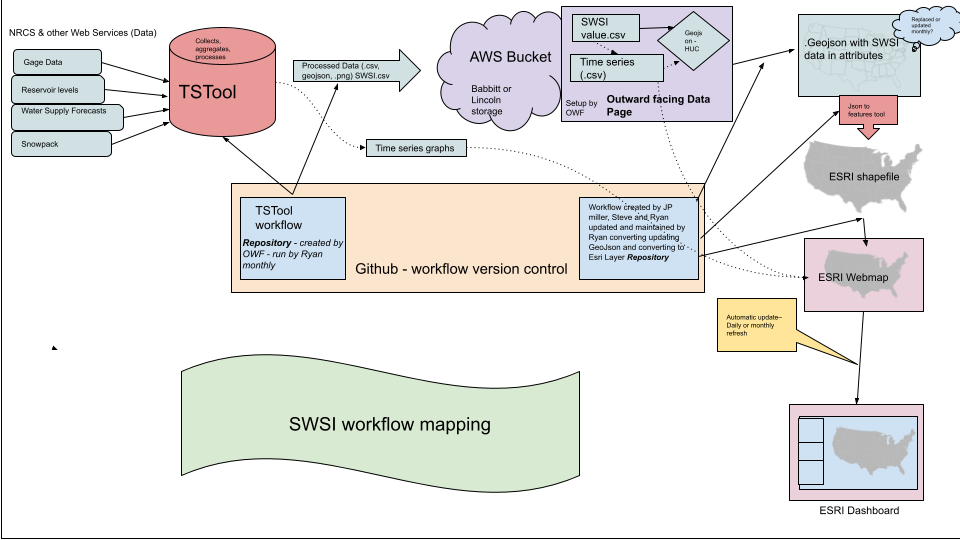
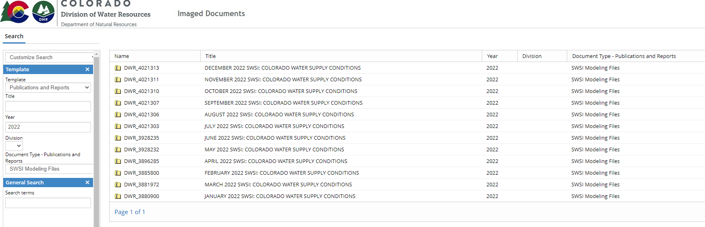

# Appendix G / Use Case for Babbitt Center Indicators #

This documentation describes a use case where the State of Colorado SWSI has been implemented for the
[Babbitt Center for Land and Water Policy](https://www.lincolninst.edu/our-work/babbitt-center-land-water-policy)
to generate water supply indicators for the Upper Colorado Basin.

*   [Introduction](#introduction)
*   [SWSI Software Setup](#swsi-software-setup)
    +   [Install the TSTool Software](#install-the-tstool-software)
    +   [Install the AWS CLI Software](#install-the-aws-cli-software)
    +   [Install the TSTool AWS Plugin](#install-the-tstool-aws-plugin)
*   [SWSI Workflow Setup](#swsi-workflow-setup)
*   [Workflow to run the Monthly SWSI Analysis](#workflow-to-run-the-monthly-swsi-analysis)
    +   [Background](#background)
    +   [Step 1 - Copy Workflow Files for New Month](#step-1-copy-workflow-files-for-new-month)
    +   [Step 2 - Download State of Colorado SWSI Files](#step-2-download-state-of-colorado-swsi-files)
    +   [Step 3 - Run the SWSI Analysis](#step-3-run-the-swsi-analysis)
    +   [Step 4 - Upload to the Cloud](#step-4-generate-information-products-and-upload-to-the-cloud)
    +   [Step 5 - SWSI Results are Published in Indicators Dashboard](#step-5-swsi-results-are-published-in-indicators-dashboard)

-----

## Introduction ##

In 2022,
the [Babbitt Center for Land and Water Policy](https://www.lincolninst.edu/our-work/babbitt-center-land-water-policy)
contracted with the Open Water Foundation
to utilize the Colorado automated SWSI tools as a water supply indicator for the Upper Colorado River Basin.

The following technical activities resulted from the project:

*   the original State of Colorado 2015 SWSI project files were migrated to a
    [GitHub repository](https://github.com/OpenWaterFoundation/owf-model-swsi)
*   the SWSI workflow files were published as a
    [downloadable installer](https://models.openwaterfoundation.org/surface-water-supply-index/)
*   the documentation was migrated to
    [online format](https://models.openwaterfoundation.org/surface-water-supply-index/latest/doc-user/)
*   the SWSI workflow was updated to work with the latest TSTool software (14.8.0 or later for all features),
    including using indentation to clarify workflows and creating spatial and visual information products
*   the SWSI workflow has been "productized" and streamlined to allow it to be run more easily
    outside of the State of Colorado's environment
*   the workflow has been extended to add steps for the use case:
    +   add an initial step:
        -   download the State of Colorado SWSI monthly files as input to the analysis,
            to leverage data work done each month by the State of Colorado
    +   add a step at the end:
        -   create a GeoJSON file output for use with web mapping
        -   upload information products to Amazon cloud and create a dataset landing page,
            using the [TSTool AWS plugin](https://software.openwaterfoundation.org/tstool-aws-plugin/) software
*   this appendix was created using the Babbitt Center project as a use case to build on the Colorado SWSI
    (the use case can be updated in the future to enhance the workflow and process additional basins)

## SWSI Software Setup ##

This documentation describes how to set up a computer to run the SWSI analysis for this use case.
The documentation has been prepared for a Windows computer, but the SWSI workflow should work on Linux.

**This setup generally needs to occur one time.
Software versions be updated later if necessary.**

### Install the TSTool Software ###

The TSTool software is used to process the SWSI files.
At least version 14.8.0 should be used.
Download from the [OpenCDSS TSTool downloads page](https://opencdss.state.co.us/tstool/).
Run the installer to install the software.

### Install the AWS CLI Software ###

Amazon Web Services (AWS) is used to store and publish the SWSI results in the cloud, which enables public access.
[S3 storage](https://aws.amazon.com/s3/) and
[CloudFront content delivery network (CDN)](https://aws.amazon.com/cloudfront/)
services are used to store and publish the data,
which facilitates access by collaborators and the public.
This documentation does not describe creating the AWS account or configuring the AWS services.

The [AWS command line interface (CLI)](https://aws.amazon.com/cli/)
software is used to perform AWS tasks from the command line.
TSTool uses the AWS plugin developed by the Open Water Foundation to automate upload of SWSI files to AWS S3
(the plugin is described in the next section).
The TSTool plugin uses the same credential files as the AWS CLI software.
The AWS CLI can also be used for troubleshooting S3, CloudFront, and other services.
See the [Installing or updating the latest version of the AWS CLI](https://docs.aws.amazon.com/cli/latest/userguide/getting-started-install.html) documentation.

The AWS administrator for the organization should use the AWS Console for IAM services
and create credentials needed to setup the AWS CLI:

1.  Select a user.
2.  Select the ***Security credentials*** tab.
3.  Under ***Access Keys***, use the ***Create access key*** to create an access key for the user.
    The generated information is used to configure credential files located in the `.aws` folder in the user's files.

The AWS CLI and the TSTool AWS plugin require that AWS credentials are available on the computer
for the user that is running the software.
See the [Setting up the AWS CLI](https://docs.aws.amazon.com/cli/latest/userguide/getting-started-quickstart.html)
and [OWF / Learn AWS](https://learn.openwaterfoundation.org/owf-learn-aws/cli/cli) documentation.
The `aws configure` command can be used to initialize the AWS credential files in the user's `.aws` folder,
using information provided below.
The single sign-on (`sso`) properties shown in the AWS documentation are optional and can be avoided for a simple setup
(run `aws configure`, not `aws configure sso`).
Or, manually edit the `.aws` files with a text editor and insert the credentials and other properties.

The following is an example `.aws/config` file.
It is OK to copy credentials within the file.
In the following, the `babbitt-indicators` profile is configured to use with TSTool so that workflows can be shared.

```
[profile babbitt-indicators]
region = us-west-2
output = text

[profile default]
region = us-west-2
output = text
```

The following is an example `.aws/credentials` file (actual credentials have been replaced):

```
[babbitt-indicators]
aws_access_key_id = ***
aws_secret_access_key = ***

[default]
aws_access_key_id = ***
aws_secret_access_key = ***
```

### Install the TSTool AWS Plugin ###

The TSTool AWS Plugin is used to automate upload of SWSI results to AWS S3 storage
and invalidate the associated CloudFront distribution.
The TSTool workflow could be performed with the AWS CLI software;
however, the TSTool workflow streamlines the process.

Download the TSTool AWS plugin software from the Open Water Foundation
[TSTool AWS Plugin downloads page](https://software.openwaterfoundation.org/tstool-aws-plugin/).
Follow the instructions on the download page to install.

The TSTool AWS plugin does not require that AWS command line interface (CLI) is installed.
However, it does require that the AWS CLI credentials files exist in the users `.aws` folder.

## SWSI Workflow Setup ##

The SWSI files to perform the analysis consist of an Excel configuration file, TSTool command files,
and output files that are generated during the run.
Collectively, these are referred to as the "SWSI workflow" files.

The initial SWSI workflow files can be downloaded from the
[Open Water Foundation SWSI Workflow Downloads page](https://models.openwaterfoundation.org/surface-water-supply-index/).
The download file (e.g., `swsi-workflow-babbitt-2.1.0.zip`) is a zip file
containing the deployable SWSI analysis files from the
[GitHub repository](https://github.com/OpenWaterFoundation/owf-model-swsi).
The zip file combine the workflow from the State of Colorado (the `workflow/` folder in the
[GitHub repository](https://github.com/OpenWaterFoundation/owf-model-swsi)
and extra steps that have been implemented for
the Babbitt Center indicators project (the `workflow-babbitt/` files in the
[GitHub repository](https://github.com/OpenWaterFoundation/owf-model-swsi)).
Consequently, the zip file provides all of the files necessary to run the SWSI analysis for the
Babbitt Center use case.

The workflow files can be installed in any folder and are portable because workflows
use relative file and folder paths.
The following is an example folder structure for the deployed SWSI analysis.

```
C:\Users\user\
  projects\
    babbitt-indicators\
      swsi\
======== above is flexible, dated folders below are required for consistency ========
        2023-01\
          workflow\
        2023-02\
          workflow\
        2023-03\
          workflow\
        2023-04\
          workflow\
        workflow-2.1.0\
```

The workflow files from the zip file can be saved in a folder such as `workflow-2.1.0`
to save an archive of the workflow before using in production.
New workflow versions may be published in the future.

These files form the basis of the monthly SWSI analysis, which is described below.
The workflow files are used for each month's analysis.

## Workflow to run the Monthly SWSI Analysis ##

This section describes the overall workflow to run the SWSI for the Babbitt Center indicators use case.
This workflow is typically run once per month.

### Background ###

The State of Colorado SWSI, as documented in the main sections of this documentation,
is multi-step process that processes a significant amount of time series data.
The initial SWSI definition for a HUC8 basin involves determining which stream, snow,
and reservoir time series are available for the basin in order to
produce a SWSI product that considers the historical (normal) and recent period.
The analysis must also not double count water supply and therefore the configuration must handle
data correctly for upstream/local basins so that natural streamflow is used.
Although it is not not procedurally difficult,
adding data for new basins requires evaluation of available input data.

The SWSI process is broken into multiple steps to focus on different inputs (e.g., snow, reservoir, streamflow) and
allows the input data to be reviewed and data gaps to be filled where necessary,
Fixing data issues early in the process ensures that subsequent processing steps occur without issues.
For example, when an input time series is unavailable because of a measurement problem for the source data,
estimated data can be provided, with the coarsest estimation being to use the previous month's value.
Filling in gaps may involve reviewing online data and contacting people who are responsible for collecting data,
such as water commissioners or water project operators.
The workflow is designed so that data for gaps and corrections is stored in the Excel configuration file.
This allows the filled data to be archived as a monthly SWSI analysis snapshot.

Why not just let the State of Colorado run the analysis and use their output data?

1.  The State may not publish the full SWSI and results
    (although this could be improved in the future to support wider use of the results).
2.  Running the analysis locally allows the workflow to be enhanced for additional input and output,
    including additional basins, information products, and integrations.
3.  The SWSI analysis provides an example that illustrates how a workflow can be implemented for
    water supply indicators, similar to other indicators that the Babbitt Center is publishing.

Because dealing with input data issues requires experience and insight for the data,
this use case workflow relies on the final State of Colorado files,
which reflect data filling.
Consequently, running the SWSI analysis locally mainly involves running the analysis in sequence and
publishing the output products.
Although it is possible to run all the steps without review (using the `00_*` step TSTool command files),
it is recommended that each step is run and the results reviewed to understand issues that may impact the final results.
There may be opportunities to improve the overall workflow and coordinate with the State of Colorado.

If the workflow is extended to other basins,
investment will need to occur to set up the original data and to ensure that
expertise is available to handle data gaps, similar to the tasks performed by State of Colorado staff.
The workflow can be adjusted to run parallel configurations so that the original State of Colorado inputs are not modified.

The following diagram illustrates the overall workflow for the Babbitt Center indicators project:

**<p style="text-align: center;">

</p>**

**<p style="text-align: center;">
Babbitt Center SWSI Workflow (<a href="../OWF_BABBITT_SWSI_workflow_Map.png">see full-size image</a>)
</p>**

The following sections describe how to run the monthly analysis for this use case,
assuming that the software and workflow files have been setup up as described above.

### Step 1 - Copy Workflow Files for New Month ###

The SWSI Analysis uses monthly time step and is typically run once per month (after the previous month's data are available).

*   **First analysis**:
    +   Download the `swsi-workflow-babbitt-2.1.0.zip` file (or latest).
    +   Copy the `workflow/` folder from above into an archive folder (e.g., `workflow-2.1.0`),
        so that the files can be copied again later if necessary.
    +   Copy the `workflow/` folder from above into a month's `YYYY-MM` folder (e.g., `2023-01`).
*   **Second and later analysis months**:
    +   For a clean set of files, copy the archived workflow files that were downloaded
        (e.g., copy `workflow-2.1.0` files to `2023-02`).
    +   Alternatively, copy the `workflow/` folder from the most recent previous month into a new folder
        (e.g., copy `2023-01` to `2023-02`).
        Running the analysis should remove or overwrite output files from the previous analysis.
        However, running an incomplete analysis may result in mistaking old files for the current run.

The following is an example folder structure for the analysis.

```
C:\Users\user\
  projects\
    babbitt-indicators\
      swsi\
======== above is flexible, dated folders below are required for consistency ========
        2023-01\
          workflow\
        2023-02\
          workflow\
        2023-03\
          workflow\
        2023-04\
          workflow\
        workflow-2.1.0\
```

An explanation of the folders is as follows:

*   The root folder location and name (`swsi` in the above example) can vary by user because the workflows are portable.
*   The `workflow-2.1.0` folder contains the `workflow` files from the SWSI download.
    The command files in this folder are not run, but are copied to a month's `workflow` folder.
    If a new version of SWSI workflow is released, a similar versioned folder can be created sas an archive
    and can be copied to subsequent monthly folders.

The monthly timeline is generally similar to the following, using April, 2023 as an example.

**April 7, 2023** (for example):

*   State of Colorado runs the SWSI analysis.
*   The actual date varies.
*   The output is referred to as the 2023-04 SWSI.
*   SWSI files are published soon after running (see Step 2 below for how to download).

**April 14, 2023** (for example):

*   Babbitt Center staff runs the SWSI analysis using this workflow documentation.
*   The actual date varies based on when the State of Colorado publishes the SWSI files.

**April 20, 2023** (for example):

*   [State of Colorado Water Availability Task Force Meeting](https://cwcb.colorado.gov/water-availability-flood-task-forces)
*   The SWSI analysis is provided as a resource for the meeting.
*   In months when a meeting is not held, the schedule for running the SWSI analysis does not depend on the meeting date.

### Step 2 - Download State of Colorado SWSI Files ###

State of Colorado staff maintain the primary version of SWSI files and will have followed their internal process
to run the SWSI analysis.
The `CO-SWSI-Control.xlsx` Excel configuration file is updated by the State for the month and contains:

1.  configuration properties such as the month for the analysis and related periods to analyze
2.  estimated time series to fill gaps

To leverage the above work, the configuration file can be downloaded into the `01-DownloadColoradoProducts` folder.
For example, create a subfolder for each month, as shown below.
The monthly folder is useful if the workflow files are copied forward to initialize a new month.

```
01-DownloadColoradoProducts/
  2023-01/
    DWR_4035453.zip
```

State of Colorado SWSI "model" files can be downloaded from one of the following locations:

*   [Drought and Surface Water Supply Index](https://dwr.colorado.gov/services/water-administration/drought-and-swsi):
    +   This provides a list of modeling inputs for year and month.
    +   The link points to a zip file in the State's Laserfiche system.
    +   The zip file uses the Laserfiche document number, for example `DWR_4059877.zip`,
        rather than a file with year and month.
        Consequently, it is not possible to automate downloads.
*   Search the [Laserfiche system](https://dnrweblink.state.co.us/dwr/search.aspx) using query parameters as shown
    in the following image, which will download the same zip files as above.

    **<p style="text-align: center;">
    
    </p>**

    **<p style="text-align: center;">
    LaserFiche Query Example (<a href="../LaserFiche-example.png">see full-size image</a>)
    </p>**

*   The [Laserfiche SWSI query landing page](https://dnrweblink.state.co.us/dwrsearch/search.aspx?searchcommand=%7b%5bPublications+and+Reports%5d%3a%5bDocument+Type+-+Publications+and+Reports%5d%3d%22SWSI+Modeling+Files%22%7d&cr=1)
    provides a formatted list of monthly downloads.
*   The [Colorado Information Marketplace SWSI dataset](https://data.colorado.gov/Water/DWR-Surface-Water-Supply-Index-by-HUC/m9cg-gqek)
    provides access to final SWSI results but **does not** provide the SWSI configuration file.

After downloading the model files for a SWSI run, copy the `CO-SWSI-Control.xlsx` file to the monthly `workflow` folder,
overwriting the previous file if it exists.

### Step 3 - Run the SWSI Analysis ###

Each required workflow step in the month's `workflow` folder should be run to complete the SWSI analysis.
The overall workflow for this use case contains the State of Colorado SWSI workflow and
extra steps for the Babbitt Center indicators project,
which creates information products and uploads to the cloud.

Because the State of Colorado will have run the analysis using the configuration file,
the analysis should run completely.
The following are comments about warnings and errors:

*   If warnings or errors are shown when the command file is first opened,
    it is typically due to commands trying to check for input but being unable to do so because
    some data or files do not exist until the commands are run.
    This is OK because data and files will be found as the command file is run.
*   Warnings can likely be ignored since they will have been reviewed by the State of Colorado.
    For example, some locations are known to have data issues.
*   Because the overall workflow is designed to handle missing data,
    warnings and errors should become fewer as later steps in the workflow are run and missing data are filled.
*   Output products can be reviewed before uploading to the cloud (see below for a summary of products).
*   If significant errors result, contact the Open Water Foundation to help troubleshoot.

Start TSTool and run the following command files in sequence.

**<p style="text-align: center;">
SWSI Workflow TSTool Command Files to Run
</p>**

| **Folder** | **Command File** | **Comment** |
| -- | -- | -- |
| `01-DownloadNaturalFlowTimeSeries` | `01-DownloadNaturalFlowTimeSeries.tstool` | **Required** |
| `02-DownloadReservoirStorageTimeSeries` | `02-DownloadReservoirStorageTimeSeries.tstool` | **Required** |
| `04-DownloadNaturalFlowForecastTimeSeries` | `04-DownloadNaturalFlowForecast.tstool` | **Required** |
| `20-CheckRawTimeSeries` | `20-CheckRawTimeSeries.tstool` | **Required** |
| `25-FillDataAuto` | `25-FillDataAuto.tstool` | **Required** |
| `27-FillDataManual` | `27-FillDataManual.tstool` | **Required** |
| `30-CreateTimeSeriesForSWSI` | `30-CreateTimeSeriesForSWSI.tstool` | **Required** |
| `50-CalculateSWSI-HUC` | `50-CalculateSWSI-HUC.tstool` | **Required** |
|                        | `51-Create-GeoJSON.tstool` | **Required** |
|                        | `52-Create-SWSI-HeatMap.tstool` | Optional |
| `55-CalculateSWSI-Basin` | `55-CalculateSWSI-Basin.tstool` | **Required** |
|  | **See [Product Review](#product-review) discussion below.** | |
| `70-UploadToCloud` | `70-upload-dataset-to-s3-2.tstool` | **Required**|
|                    | `70-upload-dataset-to-s3.tstool` | **Required** |

#### Product Review ####

Running the above steps through `55` will generate output products in the `Results-Web` folder,
which can be reviewed locally before uploading (publishing) to the cloud using the `70*` command files.
The following products can be visually inspected:

**<p style="text-align: center;">
SWSI Output Products (folder under `Results-Web`)
</p>**

| **Folder**&nbsp;&nbsp;&nbsp;&nbsp;&nbsp;&nbsp;&nbsp;&nbsp;&nbsp;&nbsp;&nbsp;&nbsp;&nbsp;&nbsp;&nbsp;&nbsp;&nbsp;&nbsp;&nbsp;&nbsp;&nbsp;&nbsp;&nbsp;&nbsp; | **Description** |
| -- | -- |
| `graphs-png/` | Graph images that can be published:<ul><li>`01-JAN-HUC` (and similar) - SWSI graph images showing only January values for the historical and recent period, useful for understanding changes over time.  Graphs are available for each calendar month.</li><li>`ALL-BASIN` - SWSI graph images for large basins (e.g., Colorado), useful to illustrate the water supply situation in river systems.</li><li>`ALL-HUC` - SWSI graph images for HUC8 basins, available for the historical period and only the recent period.</li></ul> |
| `graphs-tsp/` | Time series product definitions, used by TSTool to format graphs, used when troubleshooting graphs. |
| `swsi-by-basin/` | Excel workbooks containing SWSI data and results for the large river basins. |
| `swsi-by-huc/` | Excel workbooks containing SWSI data and results for the HUC8 basins. |
| `swsi-summary/` | <ul><li>Excel workbooks containing SWSI and results summary</li><li>GeoJSON file containing the current month's results (for web mapping)</li><li>SWSI time series heat map images</li></ul> |
| `ts/` | Time series data files:<ul><li>comma-separated-value (`csv`) as simplest file format</li><li>DateValue (`dv`) formats, to facilitate using the data for additional analysis and visualization, useful when  TSTool is used</li></ul> |

### Step 4 - Upload to the Cloud ###

### Step 5 - SWSI Results are Used in Indicators Dashboard ###

The SWSI results published to the cloud in Step 4 can be accessed using URLs published in the landing page.
For example, the published products can can be used in the Babbitt Center indicators dashboard.
