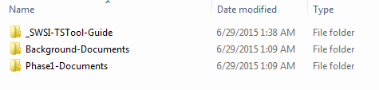
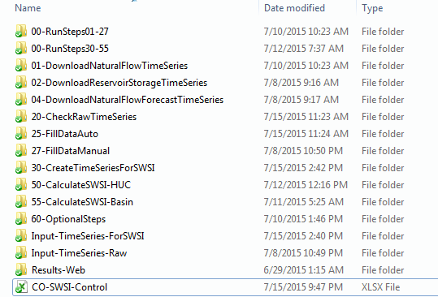

# Surface Water Supply Index / Colorado SWSI Folders #

* [Introduction](#introduction)
* [Colorado SWSI Automation Tool Folder Structure](#colorado-swsi-automation-tool-folder-structure)

-----------

## Introduction ##

The Colorado SWSI analysis is designed to be self-contained in a folder structure,
as described in this documentation.

## Colorado SWSI Automation Tool Folder Structure ##

The files for the Colorado SWSI Automation Tool are organized into two folders:
one that contains helpful documents (`_Documents`) and one that contains all files for one month’s analysis (`_2015-05`).
The `_2015-05` folder was provided by Open Water Foundation to DWR as a master copy and a starting point for subsequent monthly analyses. 
To conduct an analysis for a new month, the most recent folder should be copied and
renamed to the current month and year as `YYYY-MM` (or something similar).
As an example, the data in a `2015-05` folder would include data relevant for a May 1, 2015 SWSI analysis,
including all historical, recent, and current data, as well as all intermediate files and output files generated from the TSTool process.
 
**

**

**

Figure 5 - Highest level folder structure (<a href="../folder-highest.png">see also the full-size image</a>)

**

The `_Documents` folder contains this guide to running the Colorado SWSI Automation Tool (`_SWSI-TSTool-Guide`),
helpful background documents, and documents from the first project phase (Figure 6).
 
**

**

**

Figure 6 - `_Documents` folder (<a href="../folder-documents.png">see also the full-size image</a>)

**

The Colorado SWSI Automation Tool uses an Excel workbook (named `CO-SWSI-Control.xlsx` and referred to in
this document as the control file) and TSTool command files and time series products to perform the necessary processing.
All input data, intermediate data and computation artifacts,
and output data and graphs are saved within the `YYYY_MM` folder to help the user review and archive the results.
 
**

**

**

Figure 7 - `YYYY-MM` Folder (<a href="../folder-yyyy-mm.png">see also the full-size image</a>)

**

Figure 7 shows the contents of a `YYYY_MM` folder, which include:

* The control file (`CO-SWSI-Control.xlsx`), that controls the analysis by defining the
  configuration properties and the stations needed to run the analysis. 
* Folders whose name starts with a number (e.g., `01-DownloadNaturalFlowTimeSeries`) represent TSTool processing steps.
  The numbers in the folder names indicate the order of the processing steps,
  with gaps in the numbering to allow future additions, if necessary.
  The folders at a minimum contain a TSTool command file with the same name as the folder.
* The `Input-TimeSeries-Raw` folder contains the time series data for stations and reservoirs
  before the data are transformed into SWSI Components.
  The data are available in DateValue and Excel format for three processing stages: raw data,
  auto-filled data, and manual-filled data.
    + The final input data are written to an Excel workbook named `Final-Input-Data.xlsx`
      that contains all data flags from the data download and filling processes.
      The data flags indicate data sources, data quality issues,
      and data manipulation, and are written to help DWR understand where the data values came from.
* The `Input-TimeSeries-ForSWSI` folder contains the time series data for stations and
  reservoirs after the data are transformed into SWSI Components. 
    + The final component data are written to an Excel workbook named `SWSI-Components-Data.xlsx`
      that contains most data flags from the data download and filling processes.
      The exception to this is the Forecasted Runoff component,
      which does not include the data flags where historical natural flow data were used. 
* The `Results-Web` folder contains all tabular and graphical output products described in Colorado SWSI Output Products.
