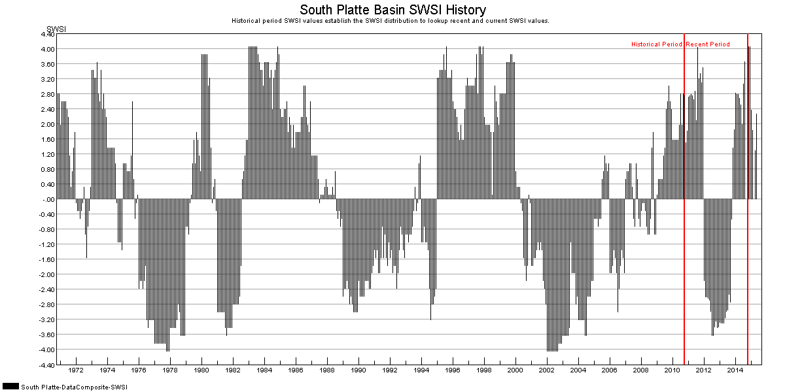
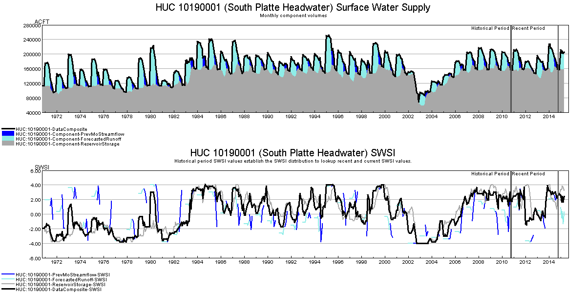
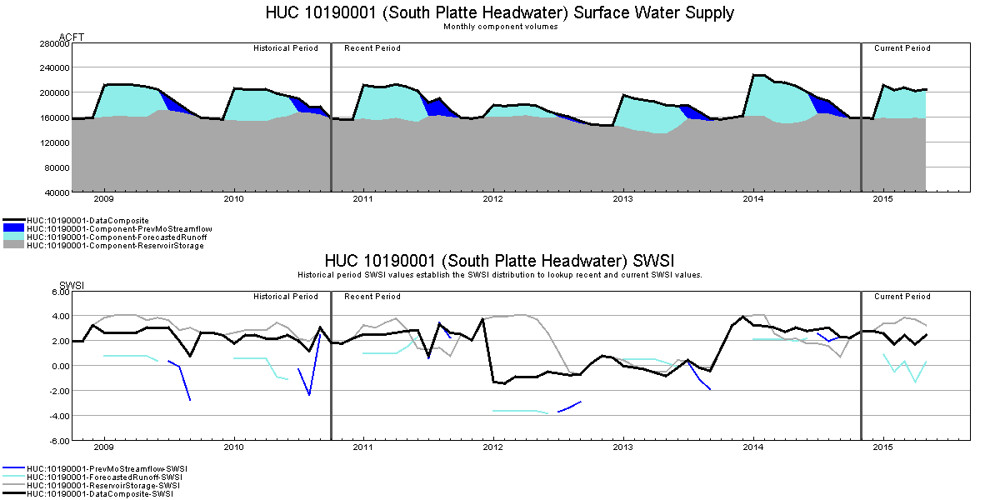
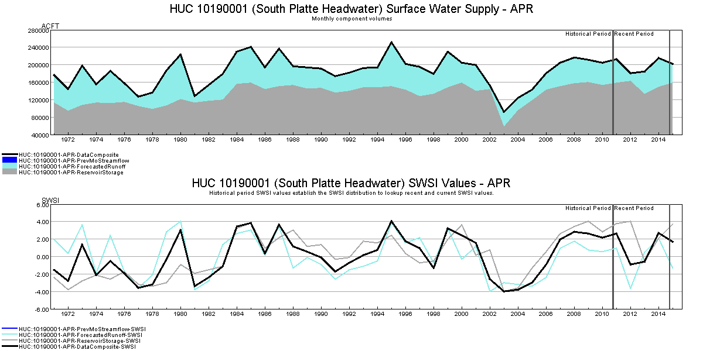

# Surface Water Supply Index / Colorado SWSI Output Products  #

*   [Introduction](#introduction)
*   [SWSI Current Summary](#swsi-current-summary)

-----------

## Introduction ##

The results from the Colorado SWSI Automation Tool are produced as both tabular and graphical outputs.
Tabular outputs are typically written to two file formats: DateValue files are used by TSTool to run the processing steps,
while Excel files are provided to facilitate user review.
HTML files can also be written to implement a website, though these commands are currently disabled in the process.

## SWSI Current Summary ##

The main output used by DWR to import results into HydroBase and the Colorado Information Marketplace
and to display results in the CDSS Map Viewer is an Excel workbook named `SWSI-Current-Summary.xlsx`,
which contains three worksheets: Basin Summary, HUC Summary, and HUC Components.
These worksheets can be written to HTML files to implement a website that facilitates
user review or product sharing though the commands are currently disabled.
The Basin Summary results worksheet (shown in Table 4) includes:

*   Basin name (`Basin`)
*   Analysis date (`Date`)
*   Composite SWSI value for the analysis date (`SWSI`)
*   Composite NEP value for the analysis date (`NEP`)
*   Composite SWSI value for the month prior to the analysis date (`SWSI Prev Mo`)
*   The change in Composite SWSI values from the previous month to the current month (`Chg SWSI Prev Mo`)
*   Composite SWSI value for the same month for the year prior to the analysis date (`SWSI Prev Yr`)
*   The change in Composite SWSI values from the previous year to the current year (`Chg SWSI Prev Yr`)

**

Table 4 - SWSI Current Summary Output - Basin Summary

**

| **Basin**        | **Date** | **SWSI** | **NEP** | **SWSI Prev Mo** | **Chg SWSI Prev Mo** | **SWSI Prev Yr** | **Chg SWSI Prev Yr** |
| ---------------- | -------- | -------- | ------- | ---------------- | -------------------- | ---------------- | -------------------- |
| Arkansas         | 2015-05  |    -0.07 |   49.18 |            -0.08 |                 0.01 |            -0.22 |                 0.15 |
| Colorado         | 2015-05  |    -1.80 |   28.34 |            -1.67 |                -0.13 |             2.21 |                -4.01 |
| Gunnison         | 2015-05  |    -2.33 |   22.07 |            -2.01 |                -0.32 |             1.57 |                -3.90 |
| Rio Grande       | 2015-05  |          |         |                  |                      |            -0.66 |                      |
| San Juan-Dolores | 2015-05  |    -3.66 |    6.05 |            -3.29 |                -0.37 |            -1.53 |                -2.13 |
| South Platte     | 2015-05  |     2.26 |   77.14 |             1.28 |                 0.98 |             2.50 |                -0.24 |
| Yampa-White      | 2015-05  |    -2.11 |   24.67 |            -2.65 |                 0.54 |             0.12 |                -2.23 |

The HUC Summary results worksheet (shown in Table 5) includes:

*   Basin name (`Basin`)
*   HUC identifier (`HUC_ID`)
*   HUC name (`HUC_Name`)
*   Analysis date (`Date`)
*   Composite SWSI value for the analysis date (`SWSI`)
*   Composite NEP value for the analysis date (`NEP`)
*   Composite SWSI value for the same month for the year prior to the analysis date (`SWSI Prev Yr`)
*   The change in Composite SWSI values from the previous year to the current year (`Chg SWSI Prev Yr`)
*   NEP value for the reservoir storage component (`ReservoirStorageNEP`)
*   NEP value for the previous month’s streamflow component (`PrevMoStreamflowNEP`)
*   NEP value for the forecasted runoff component (`ForecastedRunoffNEP`)

**

Table 5 - SWSI Current Summary Output - HUC Summary

**

| **Basin** | **HUC_ID** | **HUC_Name** | **Date** | **SWSI** | **NEP** | **SWSI Prev Yr** | **Chg SWSI Prev Yr** | **Reservoir Storage NEP** | **Prev Mo Streamflow NEP** | **Forecasted Runoff NEP** |
| -- | -- | -- | -- | -- | -- | -- | -- | -- | -- | -- |
| Arkansas | 11020001 | Arkansas Headwaters | 2015-05 | -0.66 | 42.05 | 0.91 | -1.58 | 57.64 |  | 37.80 |
| Arkansas | 11020002 | Upper Arkansas | 2015-05 | 0.77 | 59.25 | 1.49 | -0.72 | 76.99 |  | 43.93 |
| Arkansas | 11020005 | Upper Arkansas-Lake Meredith | 2015-05 | -0.39 | 45.32 | 0.60 | -0.99 | 78.03 |  | 39.53 |
| Arkansas | 11020006 | Huerfano | 2015-05 | -2.91 | 15.08 | -2.44 | -0.47 | 12.69 |  | 25.91 |
| ... | ... | ... | ... | ... | ... | ... | ... | ... | ... | ... |

The HUC Components results worksheet (shown in Table 6) includes:

*   Basin name (`Basin`)
*   HUC identifier (`HUC_ID`)
*   HUC name (`HUC_Name`)
*   Analysis date (`Date`)
*   Component (reservoir storage, previous month’s streamflow, or forecasted runoff) for which the station was used (`Component Type`)
*   Station or reservoir identifier (`Component ID`)
*   Station or reservoir name (`Component Name`)
*   Monthly component volume in ac-ft (`Component Volume`)
*   Monthly component NEP computed by month (`Component NEP by Month`)

**

Table 6 - SWSI Current Summary Output - HUC Components

**

| **Basin** | **HUC_ID** | **HUC_Name** | **Date** | **Component Type** | **Component ID** | **Component Name** | **Component Volume** | **Component NEP by Month** |
| -- | -- | -- | -- | -- | -- | -- | -- | -- |
| Arkansas | 11020001 | Arkansas Headwaters | 2015-05 | Forecasted Runoff | 07091500 | ARKANSAS RIVER AT SALIDA | 194000.00 | 38.00 |
| Arkansas | 11020001 | Arkansas Headwaters | 2015-05 | Reservoir Storage | 07007020 | CLEAR CREEK RESERVOIR | 8700.00 | 74.00 |
| Arkansas | 11020001 | Arkansas Headwaters | 2015-05 | Reservoir Storage | 07007110 | TURQUOISE LAKE | 62900.00 | 53.00 |
| ... | ... | ... | ... | ... | ... | ... | ... | ... |

## SWSI Summary by Basin ##

All of the component and result time series are written to an Excel workbook (`{BasinName}-SWSI.xlsx`) for each river basin.
These workbooks can also be written to HTML files to implement a website that
facilitates user review or product sharing though the commands are currently disabled.
The SWSI Summary by Basin results worksheet (shown in Table 7) includes:

*   Analysis date (`Date`)
*   Monthly component volume in ac-ft (`Data Composite`, `Reservoir Storage`, `Previous Month’s Streamflow` and `Forecasted Runoff`)
*   Monthly component percent of historical average computed by month (`PctOfAverage for Data Composite`, `Reservoir Storage`, `Previous Month’s Streamflow` and `Forecasted Runoff`)
*   Monthly component plotting position (`Plotting Position for Data Composite`, `Reservoir Storage`, `Previous Month’s Streamflow` and `Forecasted Runoff`)
*   Monthly component NEP value (`NEP for Data Composite`, `Reservoir Storage`, `Previous Month’s Streamflow` and `Forecasted Runoff`)
*   Monthly component SWSI value (`SWSI for Data Composite`, `Reservoir Storage`, `Previous Month’s Streamflow` and `Forecasted Runoff`)

**

Table 7 - SWSI Summary by River Basin

**

| **Date** | **Data Composite** | **Data Composite PctOfAverage** | **Data Composite Plotting Position** | **Data Composite NEP** | **Data Composite SWSI** | **...** |
| -- | -- | -- | -- | -- | -- | -- |
| 1999-10 | 975655 | 229 | 0.99 | 98.51 | 4.04 | ... |
| 1995-10 | 894473 | 210 | 0.96 | 96.02 | 3.83 | ... |
| 1985-10 | 872295 | 205 | 0.94 | 93.53 | 3.63 | ... |
| 1997-10 | 840187 | 197 | 0.91 | 91.04 | 3.42 | ... |
| 1986-10 | 836559 | 196 | 0.89 | 88.56 | 3.21 | ... |
| ... | ... | ... | ... | ... | ... | ... |

## SWSI Summary by HUC ##

All of the component and results time series are written to an Excel workbook (`{HUC_ID}-SWSI.xlsx`) for each HUC.
These workbooks can also be written to HTML files to implement a website that facilitates
user review or product sharing though the commands are currently disabled.

The SWSI Summary by HUC results worksheet (shown in Table 8) includes:

*   Analysis date (`Date`)
*   Monthly component volume in ac-ft (`Data Composite`, `Reservoir Storage`, `Previous Month’s Streamflow` and `Forecasted Runoff`)
*   Monthly component percent of historical average computed by month (`PctOfAverage for Data Composite`, `Reservoir Storage`, `Previous Month’s Streamflow` and `Forecasted Runoff`)
*   Monthly component plotting position (Plotting Position for `Data Composite`, `Reservoir Storage`, `Previous Month’s Streamflow` and `Forecasted Runoff`)
*   Monthly component NEP value (NEP for `Data Composite`, `Reservoir Storage`, `Previous Month’s Streamflow` and `Forecasted Runoff)
*   Monthly component SWSI value (SWSI for `Data Composite`, `Reservoir Storage`, `Previous Month’s Streamflow` and `Forecasted Runoff)

**

Table 8 - SWSI Summary by HUC

**

| **Date** | **Data Composite** | **Data Composite PctOfAverage** | **Data Composite Plotting Position** | **Data Composite NEP** | **Data Composite SWSI** | **...** |
| -- | -- | -- | -- | -- | -- | -- |
| 1985-10 | 65519 | 291 | 0.99 | 98.51 | 4.04 | ... |
| 1995-10 | 61046 | 271 | 0.96 | 96.02 | 3.83 | ... |
| 1979-10 | 52800 | 235 | 0.94 | 93.53 | 3.63 | ... |
| 1984-10 | 41448 | 184 | 0.91 | 91.04 | 3.42 | ... |
| ... | ... | ... | ... | ... | ... | ... |

## Time Series by HUC (or Basin) ##

All of the input, component, and results time series are written to an Excel workbook
(`{HUC_ID}-TimeSeries.xlsx` or (`{BasinName}-TimeSeries.xlsx`) for each HUC and River Basin.
The Time Series summaries by HUC (or Basin) include the same time series as the SWSI summaries,
with the addition of monthly volumes in ac-ft for each individual station used in the analysis (as shown in Table 9).
These workbooks can also be written out to HTML files to implement a website that
facilitates user review or product sharing though the commands are currently disabled.
In the HUC time series summaries, the term “HUC:” is prepended before the HUC identifier to make
it clear where results are being presented by station identifier versus HUC identifier.

**

Table 9 - Time Series by HUC (or River Basin)

**

| **Date** | **06620000 Component PrevMoStreamflow** | **06620000 Component ForecastedRunoff** | **HUC:10180001 Component ReservoirStorage** | **HUC:10180001 ReservoirStorage PctOfAverage** | **...** |
| -- | -- | -- | -- | -- | -- |
| 1970-10 | 0 | 0 | 0 | Null | ... |
| 1970-11 | 0 | 0 | 0 | Null | ... |
| 1970-12 | 0 | 0 | 0 | Null | ... |
| 1971-01 | 0 | 310163 | 0 | Null | ... |
| 1971-02 | 0 | 310163 | 0 | Null | ... |
| 1971-03 | 0 | 310163 | 0 | Null | ... |
| 1971-04 | 0 | 310163 | 0 | Null | ... |
| ... | ... | ... | ... | ... | ... |

## SWSI History Graphs by River Basin ##

Graphs are created for each river basin (`Basin-{BasinName}-SWSI-history-graph.png`) that show the time series of SWSI values
since the beginning of the historical period through the current month’s analysis (Figure 1).
Red vertical lines are used on the graphs to distinguish the historical, recent, and current periods used in the analysis.

**

**

**

Figure 1 - SWSI History Graph (River Basin) (<a href="../swsi-history-river-basin.png">see full-size image</a>)

**

## SWSI History Graphs by HUC ##

Graphs are created for each HUC that show the time series of component volumes and SWSI values for the
full analysis period for all months (`HUC-{HUC_ID}-SWSI-history-graph.png`; Figure 2)
and for all months for the recent and current periods only (`HUC-{HUC_ID}-SWSI-recent-graph.png`; Figure 3).
To change the period displayed in the recent graph, the user may change the `RecentPeriodGraphStartDate` property in the control file.

**

**

**

Figure 2 - SWSI History Graph for the Full Analysis Period (HUC) (<a href="../swsi-history-huc-full.png">see full-size image</a>)

**

**

**

**

Figure 3 - SWSI History Graph for the Recent and Current Periods (HUC) (<a href="../swsi-history-huc-recent.png">see full-size image</a>)

**

## SWSI History Graphs by HUC and Month ##

Graphs are created for each HUC and month (`HUC-{HUC_ID}-SWSI-history-{Month}-graph.png`)
that show the time series of component volumes and SWSI values for the full analysis period (Figure 4).
The following example shows April values, which show long-term trends and can be useful
if a decision process is based on April value.

**

**

**

Figure 4 - SWSI History Graph by Month for the Full Analysis Period (HUC) (<a href="../swsi-history-huc-full-month.png">see full-size image</a>)

**
